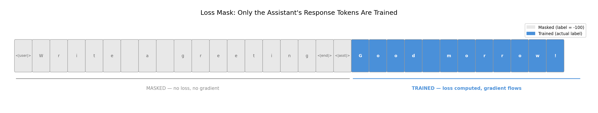
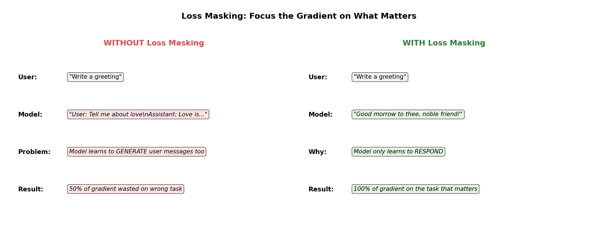
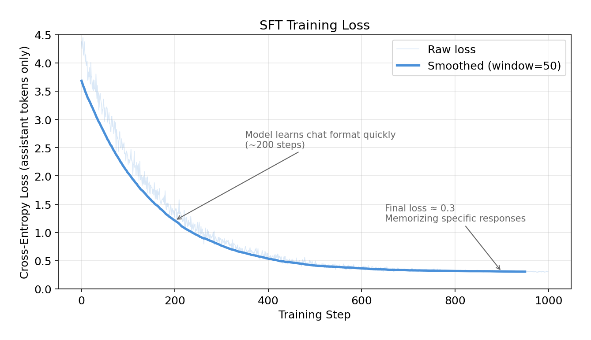
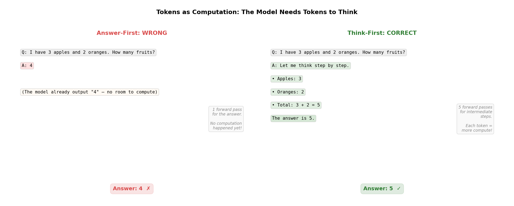

# SFT from Scratch: The Complete Implementation Guide

*Loss masking, chat templates, and the training loop — with code for every step.*

> **For a higher-level overview** of when and why to use SFT — without the code — see the companion post: [The Builder's Guide to Fine-Tuning](sft-from-scratch-builder.md).

---

**Table of Contents**

1. [The Problem: Pre-training Isn't Enough](#the-problem-pre-training-isnt-enough)
2. [The Three Stages of Post-Training](#the-three-stages-of-post-training)
3. [How OpenAI Built the InstructGPT Dataset](#how-openai-built-the-instructgpt-dataset)
4. [From Conversations to Tokens](#from-conversations-to-tokens)
5. [The SFT Model: Same Architecture, Updated Weights](#the-sft-model-same-architecture-updated-weights)
6. [The Conversation Dataset](#the-conversation-dataset)
7. [Preparing Training Data: The Loss Mask](#preparing-training-data-the-loss-mask)
8. [The Training Loop](#the-training-loop)
9. [Inference: What Happens When You Chat](#inference-what-happens-when-you-chat)
10. [Before vs. After](#before-vs-after)
11. [Catastrophic Forgetting: The Cost of New Behavior](#catastrophic-forgetting-the-cost-of-new-behavior)
12. [The Decision Guide: Building Your Own SFT Pipeline](#the-decision-guide-building-your-own-sft-pipeline)
13. [What SFT Doesn't Do](#what-sft-doesnt-do)
14. [Jagged Intelligence: Brilliant and Broken](#jagged-intelligence-brilliant-and-broken)
15. [SFT in 2025-2026: How the Industry Does It Now](#sft-in-2025-2026-how-the-industry-does-it-now)
16. [The Cost of SFT: What You'll Actually Pay](#the-cost-of-sft-what-youll-actually-pay)
17. [What Every Major Lab Did for SFT (2024–2026)](#what-every-major-lab-did-for-sft-2024-2026)
18. [Industry-Accepted Techniques](#industry-accepted-techniques)
19. [Domain-Specific SFT in Production](#domain-specific-sft-in-production)

---

## The Problem: Pre-training Isn't Enough

A pre-trained language model is an autocomplete engine. That's it. You give it text, it predicts what comes next. Ask it "What is love?" and it doesn't answer your question — it continues the text as if it were the next line in a book.

```
Prompt:  "What is love?"
Model:   "What is love? KING RICHARD: I tiny our ymy sumood veng..."
```

The model learned *language* — which tokens follow which — but not *behavior*. It has no concept of "someone asked me a question and I should answer it."

This is the gap that post-training fills. And it happens in three stages, each solving a different problem, each collecting data differently.

---

## The Three Stages of Post-Training

```
Pre-training          →    SFT          →    RLHF / DPO
learns language            learns format      learns quality
(internet text)            (demonstrations)   (preferences)
```

Each stage requires *less* human effort but produces *more* targeted improvement. It's a funnel from expensive general data to cheap specific feedback.

**Stage 1: SFT** teaches format. Humans write ideal responses from scratch — "demonstrate the behavior you want." The model is fine-tuned on these (prompt, ideal response) pairs. Same loss function as pre-training (next-token prediction), but on curated conversation data with loss masking so only the assistant's response tokens contribute to the gradient. OpenAI used ~13K demonstrations for [InstructGPT](https://arxiv.org/abs/2203.02155). This post covers SFT end-to-end.

**Stage 2: Reward Model** learns what "good" means. The SFT model generates multiple responses to the same prompt, and humans *rank* them. Comparing is dramatically easier than creating. A neural network (same transformer architecture, output replaced by a scalar score) trains on these rankings using Bradley-Terry loss: `-log(sigmoid(r_chosen - r_rejected))`. OpenAI used ~33K ranking comparisons. This is covered in a separate post.

**Stage 3: RL (PPO)** optimizes for quality. No new human data — the reward model scores responses automatically, and the policy updates toward higher scores. A KL penalty prevents reward hacking (the model finding exploits in the reward model). DPO collapses stages 2 and 3 into one step — same comparison data, but trains the language model directly. Also covered in a separate post.

| Stage | Who creates the data | Task for humans | Cost |
|---|---|---|---|
| SFT | Humans write responses | "Write the ideal answer" | High — creating is hard |
| Reward Model | Humans rank model outputs | "Which is better, A or B?" | Medium — comparing is easy |
| RL (PPO) | No humans needed | Automated loop | Low — compute only |

This is why the pipeline works at scale. You start with expensive demonstrations, extract human preferences cheaply, then run an automated optimization loop. Each stage bootstraps from the previous one.

---

## How OpenAI Built the InstructGPT Dataset

The [InstructGPT paper](https://arxiv.org/abs/2203.02155) is where this pipeline was defined. Here's how they actually collected the data.

### The labelers

OpenAI hired **~40 contractors through Upwork and ScaleAI** — not random crowdworkers, but people screened for writing quality, ability to follow nuanced instructions, sensitivity to bias, and agreement with each other. These labelers were given prompts and asked to **write the ideal assistant response from scratch**.

```
Prompt:    "Explain gravity to a 5 year old"
Labeler:   "Gravity is like an invisible hand that pulls everything
            down toward the ground. When you throw a ball up in the
            air, gravity is what makes it come back down..."
```

Their instructions had three priorities, in order: be **helpful**, be **truthful**, be **harmless**. These guidelines became the model's personality — how ChatGPT sounds, when it hedges, how detailed it gets. ~40 freelancers defined the behavior of a model used by hundreds of millions of people.

### The prompts

Prompts came from three sources:
1. **Labeler-written** — labelers invented prompts across categories (instructions, few-shot examples, personas)
2. **API user prompts** — real prompts from early OpenAI API users (summarization, code, Q&A)
3. **Filtered API prompts** — sampled from the API with duplicates and PII removed

### The scale

| Dataset | Size | What labelers did |
|---|---|---|
| SFT demonstrations | ~13,000 | Wrote ideal responses from scratch |
| Reward model comparisons | ~33,000 | Ranked 4-9 model outputs per prompt |
| RL prompts | ~31,000 | No labeling — just prompts for the PPO loop |

The progression is deliberate: 13K written responses (hard, slow) → 33K rankings (easier, faster) → 31K prompts only (no human output needed). Each stage requires less human effort but builds on the previous one.

### What they learned — the surprising insights

**Validation loss and human preference diverge.** After just 1 epoch of SFT, validation loss started going *up* — the model was overfitting by the numbers. But OpenAI kept training for 16 epochs anyway, and human raters kept preferring the responses more and more. Why? Validation loss measures "can you predict the exact next token?" Humans don't care about exact token prediction — they care about tone, helpfulness, coherence. A response can differ from the reference and still be *better*. This is why OpenAI used reward model scores, not validation loss, to select their final SFT model. The metric you optimize for has to match what you actually care about.

**13K examples is enough for format, not quality.** 13K sounds small for a 175B parameter model. But SFT isn't teaching new knowledge — the model already knows things from pre-training on the internet. SFT just teaches a new *behavior*: "when someone asks you something, respond helpfully in this format." It's like teaching someone who's read millions of books to be a good customer service agent — they already know the answers, they just need to learn the *manner* of responding. But SFT treats every example equally. A brilliant response and a mediocre one get the same gradient. That's the gap RLHF fills.

**Comparing is easier than creating.** This asymmetry is why the three-stage pipeline exists. Getting a human to *write* a perfect response is hard and slow. Getting them to look at four responses and say "D > C > A > B" is fast and cheap. And RL needs no human data at all. The pipeline is designed to spend human effort only where it's irreplaceable.

---

## From Conversations to Tokens

Now let's build SFT from scratch. We start with a character-level GPT pre-trained on Shakespeare (from [the previous post](building-gpt-from-scratch.md)). It generates Shakespeare-like text, but it's pure autocomplete. We'll turn it into an instruction-following model.

Before we get to training, let's understand how conversation data actually becomes model input. The tokenization is the same as pre-training, but there are two important differences in *what* gets tokenized.

### Pre-training: raw text in, tokens out

During pre-training, the input is raw text. Shakespeare, in our case:

```
"To be, or not to be"  →  [20, 53, 1, 40, 43, ...]
```

Every character maps to a number. The model learns to predict the next one. That's it.

### SFT: structured conversations in, tokens out

During SFT, the input is a **structured conversation** with special tokens:

```
"<|user|>What is love<|end|><|assistant|>A madness most discreet<|end|>"
```

The tokenization works the same way — text becomes numbers. But now there are **new tokens** that didn't exist during pre-training:

```
Original vocabulary: 65 Shakespeare characters (a-z, A-Z, punctuation, etc.)

New tokens added for SFT:
    Token 65: <|user|>        — marks the start of a user message
    Token 66: <|assistant|>   — marks the start of the model's response
    Token 67: <|end|>         — marks the end of a turn
```

These special tokens are **single tokens**, not character sequences. `<|user|>` isn't tokenized as `<`, `|`, `u`, `s`, `e`, `r`, `|`, `>`. It's one token: ID 65. The model needs to recognize it as a single "switch" — if it were 8 separate characters, the model would have to learn that this specific sequence has special meaning, which is much harder.

Here's what a tokenized conversation looks like:

```
<|user|>  W   h   a   t  ...  <|end|>  <|assistant|>  A     ...  <|end|>
  65      23  46  39  58       67         66          13          67
```

### What's actually different from pre-training

**The structure is imposed, not natural.** Pre-training text is just... text. Conversations have an artificial structure: user turn, then assistant turn, separated by special markers. The model has never seen this structure before. SFT teaches it what the structure means.

**Loss masking changes what gets trained on.** During pre-training, every token contributes to the loss. During SFT, only the assistant's response tokens do. But this isn't a tokenization difference — it's a training difference. We'll cover this in detail below.

Think of it like this: pre-training data is a book. SFT data is a script with stage directions. Same language, same alphabet, but the script has markers that tell actors when to speak. The special tokens are those stage directions.

### Real-world chat templates

Every model family has its own chat template. Here's what ChatGPT/GPT-4 actually uses:

```
<|im_start|>user<|im_sep|>What is 2+2?<|im_end|>
<|im_start|>assistant<|im_sep|>2+2 = 4<|im_end|>
```

`im` stands for "imaginary monologue" — OpenAI's internal name for their chat format.

| Token | What it does |
|---|---|
| `<|im_start|>` | "A new turn is starting" |
| `user` or `assistant` | The role — who's speaking |
| `<|im_sep|>` | "Role name done, here comes the message" |
| `<|im_end|>` | "This turn is over" |

Compare to what we build in this post:

```
Ours:     <|user|>What is love<|end|><|assistant|>A madness most discreet<|end|>
OpenAI:   <|im_start|>user<|im_sep|>What is love<|im_end|><|im_start|>assistant<|im_sep|>A madness most discreet<|im_end|>
```

Same idea, just more verbose. OpenAI's version is more flexible because the role (`user`, `assistant`, `system`) is a separate word between `im_start` and `im_sep`, so they can add new roles without adding new special tokens. Other model families have their own templates — Llama uses `[INST]...[/INST]`, Claude uses `\n\nHuman:...\n\nAssistant:`. The specific tokens don't matter. The structure does.

> **Key insight:** SFT tokenization is the same process as pre-training — text becomes token IDs. The difference is that conversations include special tokens that act as structural markers, and we only train on the assistant's portion.

---

## The SFT Model: Same Architecture, Updated Weights

A common misconception: SFT must use a different model architecture. It doesn't. The SFT model is the **exact same transformer** — same multi-head attention, same feedforward layers, same residual connections, same layer normalization, same number of blocks. Not a single layer is added or removed.

```
Pre-trained model:                    SFT model:
┌──────────────────────────┐         ┌──────────────────────────┐
│ Token Embedding (65)     │ ──copy──▶ Token Embedding (68)     │ ← 3 new rows (random)
│ Position Embedding       │ ──copy──▶ Position Embedding       │
│                          │         │                          │
│ ┌──────────────────────┐ │         │ ┌──────────────────────┐ │
│ │ Block 1              │ │         │ │ Block 1              │ │
│ │  Multi-Head Attention│ │ ──copy──▶ │  Multi-Head Attention│ │
│ │  FeedForward         │ │         │ │  FeedForward         │ │
│ │  LayerNorm + Residual│ │         │ │  LayerNorm + Residual│ │
│ └──────────────────────┘ │         │ └──────────────────────┘ │
│ Block 2: ...             │ ──copy──▶ Block 2: ...             │
│ Block 3: ...             │ ──copy──▶ Block 3: ...             │
│ Block 4: ...             │ ──copy──▶ Block 4: ...             │
│                          │         │                          │
│ Output Head (→65 logits) │ ──copy──▶ Output Head (→68 logits) │ ← 3 new outputs (random)
└──────────────────────────┘         └──────────────────────────┘
```

Each block contains: multi-head attention (tokens look at each other and decide what's relevant), feedforward network (each token "thinks" independently through a 2-layer neural net), layer normalization (keeps values stable), and residual connections (skip connections that prevent information from getting lost in deep networks). Our model stacks 4 of these blocks. GPT-3 has 96. Same concept, different depth.

### How weights are transferred

1. **Create a new model** with vocabulary size 68 (all weights random)
2. **Copy every pre-trained weight** — attention layers, feedforward layers, layer norms, all copied exactly
3. **For the embedding and output head** — copy the first 65 rows (original characters). The 3 new rows (`<|user|>`, `<|assistant|>`, `<|end|>`) stay randomly initialized

After this copy, the SFT model is identical to the pre-trained model for all original tokens. It already knows Shakespeare. The only random parts are the embeddings for the 3 new special tokens.

### What SFT training does to the weights

During SFT, gradients flow through the **entire model** — not just the 3 new embeddings. Every attention weight, every feedforward weight, everything gets nudged slightly toward producing better responses after `<|assistant|>`. The lower learning rate (1e-4 vs 3e-4 in pre-training) keeps these nudges small so pre-trained knowledge isn't destroyed.

The weights don't get replaced. They get nudged. Think of it as the model's Shakespeare knowledge shifting slightly to also accommodate a new skill: responding to instructions.

---

## The Conversation Dataset

Each training example is a (instruction, response) pair formatted with the chat tokens:

```
<|user|>Write a greeting<|end|><|assistant|>Good morrow to thee, noble friend!<|end|>
```

Here are some example training conversations — all in Shakespeare's voice, since that's what the base model knows:

```python
conversations = [
    ("Write a greeting", "Good morrow to thee, noble friend!"),
    ("Say goodbye", "Farewell, and may fortune smile upon thee."),
    ("Who are you", "A humble player upon this stage of words."),
    ("Speak of love", "Love is a smoke raised with the fume of sighs."),
    ("I am sad", "Take heart, for sorrow fades as morning comes."),
    # ... 35 more examples covering questions, advice, emotions
]
```

40 examples is tiny. InstructGPT used 13,000. But even this small dataset is enough to teach a behavioral shift — the model learns the *pattern* (instruction → response) and can generalize to unseen prompts.

In practice, data quality matters far more than quantity. A few thousand carefully written examples by domain experts beats hundreds of thousands of noisy crowdsourced ones. The SFT dataset defines the model's personality.

For real-world open SFT datasets, [OpenAssistant Conversations (OASST)](https://huggingface.co/datasets/OpenAssistant/oasst1) is a good example — ~160K messages in conversation trees, written by volunteers. A typical example: `"User: What is the difference between a compiler and an interpreter? → Assistant: A compiler translates the entire source code into machine code before execution, while an interpreter translates and executes code line by line..."`. Same structure as what we're building, just at scale.

### Single-turn vs. multi-turn conversations

We use **single-turn** conversations — one user message, one assistant response:

```
<|user|>Write a greeting<|end|><|assistant|>Good morrow to thee, noble friend!<|end|>
```

Production models train on **multi-turn** conversations — multiple back-and-forth exchanges in one sequence:

```
<|user|>Hi<|end|><|assistant|>Hello! How may I help thee?<|end|><|user|>What is love?<|end|><|assistant|>A madness most discreet, a bitter sweet.<|end|>
```

The mechanics are identical. The only difference is that multi-turn has multiple assistant segments to train on — the mask alternates (user: masked, assistant: trained, user: masked, assistant: trained).

---

## Preparing Training Data: The Loss Mask

This is the section that makes SFT different from pre-training. Everything else — the model, the optimizer, the loss function — is borrowed. The loss mask is what's new.

### Step 1: Shift by one (same as pre-training)

We take a sequence of tokens, shift it by one position, and create (input, label) pairs. The model sees `input_ids` and should predict `labels`:

```
Tokens:     [65, 23, 56, 47, 58, 43, 67, 66, 19, 53, 53, 42, 67]
input_ids:  [65, 23, 56, 47, 58, 43, 67, 66, 19, 53, 53, 42]
labels:     [23, 56, 47, 58, 43, 67, 66, 19, 53, 53, 42, 67]
```

Position 0 sees token 65, should predict token 23. Same shift-by-one logic as pre-training.

### Step 2: Mask user tokens with -100 (new for SFT)

Now the key difference. We set every label in the user portion to `-100`:



```
input_ids:  [65,   23,   56,   47,   58,   43,   67,   66,   19,   53,   53,   42  ]
            <|user|> W     h     a     t     ...   <|end|> <|asst|> G     o     o     d
labels:     [-100, -100, -100, -100, -100, -100, -100, -100,  53,   53,   42,   67  ]
             ◄──────────── user: MASKED ──────────────────► ◄── assistant: TRAINED ──►
```

Why `-100`? It's PyTorch's convention. When you call `F.cross_entropy(logits, labels, ignore_index=-100)`, any position with label `-100` is **completely skipped** — zero loss, zero gradient.

### What -100 actually does: a position-by-position walkthrough

This is worth understanding in detail. Let's trace what happens at each position after the forward pass:

```
┌─────────────────────────────────────────────────────────────────────────┐
│                         FORWARD PASS                                    │
│  Model reads ALL tokens (user + assistant). Every token flows through   │
│  attention and feedforward. The model produces a prediction at EVERY    │
│  position. Nothing is skipped.                                          │
└────────────────────────────────┬────────────────────────────────────────┘
                                 │
                                 ▼
┌─────────────────────────────────────────────────────────────────────────┐
│                      LOSS COMPUTATION                                   │
│                                                                         │
│  Position 0: label = -100                                               │
│    → Cross-entropy sees -100 → SKIP                                     │
│    → Loss: 0    Gradient: 0                                             │
│                                                                         │
│  Position 1: label = -100                                               │
│    → SKIP. Loss: 0. Gradient: 0.                                        │
│                                                                         │
│  ...all user positions skipped...                                       │
│                                                                         │
│  Position 8: label = 53 (the token 'o')                                 │
│    → Model predicted 'o' with 40% confidence                            │
│    → Loss: -log(0.40) = 0.92                                            │
│    → Gradient FLOWS BACK through entire model ←──── weights get nudged  │
│                                                                         │
│  Position 9: label = 53 (the token 'o')                                 │
│    → Loss computed. Gradient flows.                                      │
│                                                                         │
│  ...all assistant positions graded...                                   │
└─────────────────────────────────────────────────────────────────────────┘
```

The crucial point: **the model reads everything, but is only graded on assistant tokens.** Think of it like a student reading a test question (no grade for reading) and writing an answer (graded). The reading is necessary — without it the student can't answer — but only the answer counts.

### Why mask user tokens at all?

Without masking, half the gradient would come from predicting user messages — teaching the model to write what users say. That's useless at inference (users write their own messages) and it dilutes the training signal. Masking focuses 100% of the learning on the only part that matters: generating good responses.



### Two masks, two purposes

This confused me at first: SFT has *two* completely different masks that do different things at different stages. Here's the distinction:

```
                    ┌─────────────────────────────────────┐
                    │         INSIDE THE MODEL             │
                    │                                      │
                    │    Causal Attention Mask              │
                    │    ┌──────────────────┐              │
                    │    │ 0  -∞  -∞  -∞   │              │
                    │    │ 0   0  -∞  -∞   │              │
                    │    │ 0   0   0  -∞   │              │
                    │    │ 0   0   0   0   │              │
                    │    └──────────────────┘              │
                    │    Prevents looking at future tokens │
                    │    Applied BEFORE softmax            │
                    │    Used in BOTH pre-training and SFT │
                    └─────────────────┬───────────────────┘
                                      │
                                      ▼
                              predictions for
                              every position
                                      │
                                      ▼
                    ┌─────────────────────────────────────┐
                    │        OUTSIDE THE MODEL             │
                    │                                      │
                    │    Loss Mask (-100 labels)            │
                    │                                      │
                    │    labels: [-100, -100, ..., 53, 67] │
                    │             ◄─ user ─►  ◄─ asst ──► │
                    │                                      │
                    │    Prevents gradient from user tokens │
                    │    Applied in loss function           │
                    │    Used ONLY in SFT                   │
                    └─────────────────────────────────────┘
```

| | Causal attention mask | Loss mask (-100) |
|---|---|---|
| **Where** | Inside the model's attention layers | In the loss function, after the forward pass |
| **When** | During the forward pass | During loss computation |
| **What it does** | Prevents tokens from looking at future tokens | Prevents gradient from user-token positions |
| **How** | Sets attention scores to `-inf` before softmax | Sets labels to `-100` in cross-entropy |
| **Affects what model sees?** | Yes | No — model sees all tokens normally |
| **Used in pre-training?** | Yes | No |
| **Used in SFT?** | Yes | Yes |

### Whole conversations, not random chunks

One more difference from pre-training. In pre-training, the training text is one long stream (~1M characters of Shakespeare). We randomly slice it into chunks of 64 tokens — each chunk is a random window into the text.

In SFT, each conversation is a **complete, self-contained sequence**. No slicing, no random windows. Each conversation becomes one training example, padded to the block size:

```
Conversation 1: <|user|>Write a greeting<|end|><|assistant|>Good morrow...<|end|>[pad][pad]...
Conversation 2: <|user|>Say goodbye<|end|><|assistant|>Farewell...<|end|>[pad][pad]...
```

You can't slice conversations in half — that would break the structure.

### Full worked example

Let's trace one conversation through the entire preparation pipeline:

```
Raw conversation:
  ("Write a greeting", "Good morrow to thee, noble friend!")

Step 1 — Wrap in chat template:
  "<|user|>Write a greeting<|end|><|assistant|>Good morrow to thee, noble friend!<|end|>"

Step 2 — Tokenize (each character or special token → a number):
  [65, 23, 56, 47, 58, 43, 1, 39, 1, 45, 56, 43, 43, 58, 47, 52, 45, 67, 66, 19, 53, 53, 42, ...]
   ↑                                                                  ↑   ↑
  <|user|>                                                        <|end|> <|assistant|>

Step 3 — Shift to create input/label pairs:
  input_ids: [65, 23, 56, 47, ..., 67, 66, 19, 53, ..., 67, 0, 0, 0]
  labels:    [23, 56, 47, 58, ..., 66, 19, 53, 53, ...,  0, 0, 0, 0]

Step 4 — Apply loss mask:
  labels:  [-100,-100,-100,-100, ...,-100,-100, 53, 53, ..., 67,-100,-100,-100]
            ◄──── user: MASKED ──────────────► ◄── assistant: TRAINED ──► ◄pad►
```

Multi-turn follows the same process — every user segment gets masked, every assistant segment gets trained on:

```
<|user|>Hi<|end|>  <|assistant|>Hello! How may I help?<|end|>  <|user|>What is love?<|end|>  <|assistant|>A madness most discreet.<|end|>
      -100 -100            ✓ ✓ ✓ ✓ ✓ ✓ ✓ ✓ ✓ ✓ ✓                    -100 -100 -100               ✓ ✓ ✓ ✓ ✓ ✓ ✓ ✓
  ◄─ user 1: masked ─►  ◄── assistant 1: TRAINED ──►            ◄── user 2: masked ──►        ◄── assistant 2: TRAINED ──►
```

### The code

```python
def prepare_sft_example(user_msg, asst_msg):
    text = f"<|user|>{user_msg}<|end|><|assistant|>{asst_msg}<|end|>"
    tokens = encode_sft(text)

    input_ids = tokens[:-1]    # what the model sees
    labels = tokens[1:]        # what it should predict (shifted by 1)

    # Find the <|assistant|> token position
    asst_pos = input_ids.index(ASSISTANT_TOKEN_ID)

    # Mask everything up to and including <|assistant|>
    for i in range(asst_pos + 1):
        labels[i] = -100       # ignored in loss computation

    return input_ids, labels
```

---

## The Training Loop

The SFT training loop is surprisingly similar to pre-training. Here's what stayed the same and what's different:

### Same as pre-training
- **Optimizer:** AdamW — same algorithm, same weight decay
- **Forward pass:** Model processes tokens, produces logits (predictions for every position)
- **Backward pass:** Compute gradients from the loss, update weights
- **Loss function:** Cross-entropy — still measuring "how well did you predict the next token?"
- **Batching:** Randomly sample a batch of examples each step

### New for SFT
- **Lower learning rate** (1e-4 vs 3e-4) — we're fine-tuning, not training from scratch. Large updates would destroy pre-trained knowledge.
- **`ignore_index=-100`** in cross-entropy — the one line that makes it SFT. Masked positions contribute zero to the loss and zero to the gradient.
- **Dataset is conversations, not text chunks** — we sample from 40 complete conversations instead of random slices of Shakespeare.

```python
optimizer = torch.optim.AdamW(sft_model.parameters(), lr=1e-4)  # lower LR than pre-training

for step in range(1000):
    xb, yb = get_sft_batch()                          # sample conversations (not text chunks)
    logits, _ = sft_model(xb)
    loss = F.cross_entropy(logits, yb, ignore_index=-100)  # THE key line — only grade assistant tokens

    optimizer.zero_grad()
    loss.backward()
    optimizer.step()
```

1,000 steps. 40 examples. The loss drops from ~4.0 to ~0.3 — the model quickly learns the conversation pattern.



Notice the shape: the model learns the chat format fast (the steep drop in the first ~200 steps), then gradually memorizes specific responses. This is typical of SFT on small datasets — format is learned quickly, content takes longer.

---

## Inference: What Happens When You Chat

After SFT training, how does the model actually respond to a message? You type "What is love?" — but the model never sees that raw text. The system wraps it in the chat template first:

```
You type:         What is love?

System wraps it:  <|user|>What is love?<|end|><|assistant|>
                                                    ↑
                                              this is the trigger
```

The `<|assistant|>` at the end is the trigger. SFT trained the model on examples where `<|assistant|>` was always followed by a helpful response — so that's what it predicts next. Token by token:

```
┌─────────────────────────────────────────────────────────────────────┐
│  <|user|>What is love?<|end|><|assistant|>                          │
│                                            ↓                        │
│                                  model predicts: "A"                │
│                                                                     │
│  <|user|>What is love?<|end|><|assistant|>A                         │
│                                             ↓                       │
│                                  model predicts: " "                │
│                                                                     │
│  <|user|>What is love?<|end|><|assistant|>A                         │
│                                              ↓                      │
│                                  model predicts: "m"                │
│                                                                     │
│  ...continues until the model generates <|end|>, then stops.        │
└─────────────────────────────────────────────────────────────────────┘
```

The model doesn't "know" it's a chatbot. It's still just autocompleting — but SFT shaped *what* gets autocompleted after `<|assistant|>`. For multi-turn conversations, the system concatenates the entire history before appending the next `<|assistant|>` trigger, which is why context windows eventually fill up.

```python
def chat(model, user_msg):
    prompt = f"<|user|>{user_msg}<|end|><|assistant|>"  # system adds the template
    tokens = encode_sft(prompt)
    output = model.generate(tokens, max_new_tokens=60)   # same generate() as pre-training
    # extract text after <|assistant|>, stop at <|end|>
```

---

## Before vs. After

The behavioral shift is immediate and visible:

```
┌──────────────────────┬──────────────────────────────────────────────────┐
│ Prompt               │ Base model (autocomplete)  → SFT model (chatbot)│
├──────────────────────┼──────────────────────────────────────────────────┤
│ "Write a greeting"   │ "Write a greeting do       → "Good morrow to    │
│                      │  sther and LUCHENTT..."       thee, noble friend!"│
├──────────────────────┼──────────────────────────────────────────────────┤
│ "Who are you"        │ "Who are you, fares be     → "A humble player    │
│                      │  a that the kin..."           upon this stage."   │
├──────────────────────┼──────────────────────────────────────────────────┤
│ "Speak of love"      │ "Speak of love be dond     → "Love is a smoke    │
│                      │  and KING wose..."            raised with sighs." │
└──────────────────────┴──────────────────────────────────────────────────┘
```

The base model treats every prompt as text to continue. The SFT model recognizes the chat template and switches into response mode. Same architecture, same weights (mostly) — the only difference is 1,000 steps of fine-tuning with loss masking.

The more interesting test is **unseen prompts** — instructions that never appeared in the training data:

```
"Tell a joke"         (not in training data)  →  "A fool with wit is wiser than a sage!"
"Describe the moon"   (not in training data)  →  "The moon doth rise upon the sleeping world."
```

The model generalized. It didn't memorize 40 question-answer pairs — it learned the *pattern*: when you see `<|user|>...<|end|><|assistant|>`, switch from reading to responding. The special tokens became behavioral triggers.

**A note on our tiny model:** with only 4 blocks, 64-dimensional embeddings, and ~200K parameters, the responses are imperfect. A real SFT model (with billions of parameters and thousands of training examples) produces much more coherent output. The point here is the *mechanics* — the architectural pattern is identical whether the model has 200K or 200B parameters.

---

## Catastrophic Forgetting: The Cost of New Behavior

SFT isn't free. Fine-tuning shifts the model's weights toward the conversation format, and some pre-training knowledge gets overwritten. This is called **catastrophic forgetting**.

We can measure it by checking the model's loss on the original Shakespeare validation data. Our SFT model's Shakespeare loss went from 2.12 to 2.31 — a +9% degradation. The model traded some language modeling ability for instruction-following ability.

Our toy model shows an extreme case (+37% worse on the full metric) because we full-fine-tuned all parameters on just 40 examples for ~25 epochs. Production models keep forgetting to ~1-3% using four strategies:

**LoRA — only touch ~1% of parameters.** The biggest lever. Freeze the entire pre-trained model, add tiny trainable adapter matrices alongside each layer. The pre-trained weights are literally unchanged — the adapters learn just the delta needed for instruction-following. A 70B model fine-tunes ~700M parameters instead of 70B.

**Mix in pre-training data.** OpenAI's PPO-ptx approach: each SFT training batch includes ~10-20% original pre-training data. The model rehearses old knowledge while learning new behavior.

**Lightweight SFT, heavy RL.** The 2025-2026 industry strategy. Do *less* SFT (1-2 epochs on pruned data — just enough to teach the format), then push quality improvement to RL. RL uses a KL penalty that explicitly constrains the model to stay close to its starting point, so it improves quality without the same forgetting cost.

**Fewer epochs on harder data.** Meta prunes 50-95% of SFT examples, keeping only the hardest ones. Fewer gradient updates = less overwriting.

| Factor | Our toy model | Production 2026 |
|---|---|---|
| Parameters updated | 100% (full fine-tune) | ~1% (LoRA) |
| SFT epochs | ~25 | 1-2 |
| Pre-training data mixed in | No | Yes |
| Forgetting | +37% | ~1-3% |

> **Key insight:** Forgetting is a fundamental property of gradient-based learning — it never goes to zero. The modern strategy is to minimize SFT's footprint (LoRA, fewer epochs, data mixing) and let RL handle quality improvement with explicit constraints against drift.

---

## The Decision Guide: Building Your Own SFT Pipeline

You understand the mechanics. Now the harder question: how do you make the right choices when building your own SFT pipeline? Every decision below involves a tradeoff. Here's how to reason about each one.

### How much data do you need?

The short answer: less than you think, if it's good.

SFT isn't teaching new knowledge — the model already learned that during pre-training. SFT is teaching a *behavior*: "when someone asks you something, respond helpfully." Behaviors are learned from fewer examples than knowledge.

| Goal | Dataset size | Why |
|---|---|---|
| Teach the chat format | ~100-500 examples | The model just needs to learn the structural pattern |
| Teach a specific persona or domain | ~1K-5K examples | More variety needed to generalize |
| Production-quality instruction-following | ~5K-50K (filtered) | Diversity across task types matters |

The InstructGPT insight that surprised everyone: 13K examples was enough for a 175B parameter model. But those 13K were written by carefully selected human labelers. One high-quality example is worth more than a hundred noisy ones.

**The practical test:** generate 5-10 responses from your SFT model on prompts *not* in the training data. If the model follows the format but gives mediocre answers — your SFT is working, and quality improvement is a job for RLHF/DPO, not more SFT data. If the model doesn't follow the format at all — you need more diverse examples of the format.

### Choosing the learning rate

This is the most consequential hyperparameter in SFT.


**Too high (e.g. same as pre-training):** The model learns the chat format fast but overwrites pre-trained knowledge. You'll see unstable loss curves with spikes, and the model may produce incoherent outputs that happen to follow the chat template. Catastrophic forgetting gets severe.

**Too low:** The model barely moves from its pre-trained behavior. After 1,000 steps it still autocompletes instead of responding to instructions. You're wasting compute.

**The sweet spot** is typically **2x-10x lower than the pre-training learning rate**. For our model: pre-training used 3e-4, SFT uses 1e-4. For production models pre-trained at 1e-4, SFT often uses 1e-5 to 5e-5.

**A practical heuristic:** start at 1/3 of your pre-training LR. If the loss drops smoothly and the model generates coherent responses after ~200 steps, you're in the right range. If the loss is jumpy, halve the LR. If the loss barely moves after 500 steps, double it.

### When to stop training

This is where SFT gets counterintuitive. Unlike pre-training, **lower loss doesn't always mean a better model.**

The InstructGPT team found that validation loss started going *up* after just 1 epoch — the model was overfitting by the numbers. But they kept training for 16 epochs, and human raters kept preferring the responses more and more. Why?

Validation loss measures "can you predict the exact next token in a held-out conversation?" But that's not what you actually care about. You care about: does the model follow instructions? Is the response helpful? A response can differ from the reference and still be *better*.

**What to watch instead:**

1. **Manual spot-checking** — the most reliable signal. Every 200-500 steps, generate responses to 10-20 test prompts (mix of seen and unseen). Read them. Are they following the format? Are they coherent? This is what OpenAI used to select their final SFT model.

2. **Format compliance rate** — what percentage of responses start with a coherent answer and end with `<|end|>`? This should climb quickly and plateau.

3. **Training loss (with caveats)** — useful for catching problems (loss going *up* means something is broken, spikes mean LR is too high), but not useful as a selection criterion.

**A reasonable stopping rule:** train for 2-5 epochs over your dataset. Checkpoint every epoch. Pick the checkpoint where manual evaluation looks best, not where loss is lowest.

### With or without loss masking?

Always use masking. But it's worth understanding what happens without it, so you can debug if you accidentally skip it.

**Without masking:** the model trains on predicting both user and assistant tokens. ~50% of the gradient comes from learning to generate user messages. The model may start producing outputs like `"User: Tell me about love\nAssistant: Love is..."` — it learned to write the entire conversation, including the user's part. At inference, when you prompt with `<|assistant|>`, the model might generate user messages instead of responding.

**With masking:** 100% of the gradient goes toward generating good responses. The model reads user tokens (they flow through attention) but is only graded on what it generates. Cleaner, faster convergence.

**The one exception:** some teams train *without* masking intentionally when they want the model to learn to simulate conversations (e.g., for synthetic data generation). But for building a chatbot, always mask.

### How to evaluate SFT quality

Loss alone is a poor signal. Here's a practical evaluation framework:

**1. Format compliance (automated)**
```python
# After generating a response, check:
# - Does it contain content after <|assistant|>?
# - Does it stop at <|end|> (not run on forever)?
# - Does it NOT generate <|user|> tokens (it shouldn't write user messages)?
```

**2. Generalization test (manual, most important)**

Test on prompts the model never saw during training. If your SFT dataset is about customer service, try:
- In-domain unseen: new customer service questions
- Near-domain: general helpfulness questions
- Out-of-domain: completely unrelated instructions

If the model handles in-domain unseen prompts well, SFT is working. If it also handles near-domain, it generalized the format — not just the content. That's what you want.

**3. Regression check (automated)**

Measure loss on a held-out set from the pre-training data. If it increased by more than ~10-15%, catastrophic forgetting is getting severe. Consider lowering the learning rate or adding pre-training data to your SFT mix.

### Failure modes and how to fix them

| Symptom | Likely cause | Fix |
|---|---|---|
| Model ignores chat format, just autocompletes | Too few training steps or LR too low | Train longer or increase LR |
| Model follows format but outputs are incoherent gibberish | LR too high — destroyed pre-trained knowledge | Lower LR, restart from pre-trained checkpoint |
| Model memorizes training examples verbatim | Too many epochs on too small a dataset | Add more diverse examples, or stop earlier |
| Model generates user messages in its response | Loss masking not applied correctly | Debug your mask — check that all labels before `<|assistant|>` are -100 |
| Good on training prompts, bad on unseen prompts | Overfitting to specific prompts | Add more diverse prompts (not more responses per prompt) |
| Shakespeare quality dropped significantly | Too many SFT steps or LR too high | Mix in pre-training data, use LoRA, or reduce epochs |

### Data quality checklist

Before training, audit your dataset:

- **Consistent format** — every example follows the same chat template exactly. One missing `<|end|>` token can confuse the model.
- **Response quality** — the model will imitate your data. If your responses are mediocre, the SFT model will be mediocre. This is not something more data fixes.
- **Prompt diversity** — 50 examples of "write a poem" teach less than 5 examples each of 10 different task types. Breadth of prompts matters more than depth.
- **Appropriate length** — responses should be similar in length to what you want at inference. If all training responses are 3 sentences, the model will learn to generate ~3 sentences.
- **No contradictions** — if one example says "I am a helpful assistant" and another says "I am a Shakespearean poet," the model will randomly pick between them. Be consistent about what the model is.

### Putting it together: a minimal SFT recipe

If you're building SFT from scratch, here's the sequence:

1. **Start with a pre-trained model** that generates coherent text in your domain
2. **Write 50-100 high-quality examples** by hand — these set the tone and format
3. **Expand to 500-5K examples** synthetically (use a stronger model) or via careful collection
4. **Filter aggressively** — remove duplicates, low-quality responses, and anything off-format
5. **Train for 2-3 epochs** at 1/3 of the pre-training LR
6. **Evaluate manually** on 20+ unseen prompts after each epoch
7. **Pick the best checkpoint** based on manual eval, not loss
8. **Check regression** on pre-training data to monitor forgetting

This gets you a model that follows instructions. Quality improvement — making responses *good*, not just *formatted* — is the job of RLHF or DPO.

---

## What SFT Doesn't Do

SFT teaches format, not quality. Every training example gets the same weight. A brilliant response and a mediocre one produce identical gradients. The model learns "when prompted, generate a response" — but it has no mechanism to learn *which* responses are better.

This is the gap that the next stages fill:
- **RLHF** trains a reward model on human preferences, then uses reinforcement learning (PPO) to optimize the policy toward higher-scoring responses
- **DPO** skips the reward model entirely and trains directly on preference pairs using a single loss function

SFT is the foundation. It gets the model into the right format so that preference learning can refine the quality. Without SFT, the model wouldn't know how to respond at all. Without RLHF or DPO, the model responds but doesn't know what "good" means.

```
Pre-training    →    SFT           →    RLHF / DPO
learned language     learned format      learned quality
```

### Knowledge of self: the model doesn't know what it is

A pre-trained model has no identity. It doesn't know its name, who made it, or what it can do. This is taught through three methods — all using mechanisms we've already seen:

**1. SFT training examples** — bake identity into the weights by including examples like `"What's your name?" → "I'm ChatGPT, made by OpenAI."` The model sees enough of these during fine-tuning that it responds consistently about its own identity. Downside: it's frozen in the weights. Rename the product and you need to retrain.

**2. System message at inference** — prepend a hidden `<|system|>` turn to every conversation at runtime: `"You are ChatGPT, made by OpenAI. Knowledge cutoff: April 2024. Today's date: Feb 23, 2026."` The model reads this through attention every conversation — it's just more text in the context window. This is why models can tell you today's date even though their weights are frozen. Cheaper and more flexible than retraining.

**3. Both (what production models do)** — SFT teaches the base behavior ("I'm a helpful AI assistant"), the system message overrides specifics at runtime (name, date, available tools). SFT makes the model *receptive* to system messages — it learns during training that the `<|system|>` turn contains instructions it should follow.

No special architecture. Just SFT examples + a hidden prompt the user doesn't see.

### Hallucination: why SFT models make things up

There's a deeper problem SFT doesn't fix: **hallucination**. The model confidently generates plausible-sounding but factually wrong information. This isn't a bug — it's a direct consequence of how the model works.

Remember: the model is still just predicting the next token. During pre-training, it learned which tokens are *likely* to follow which. During SFT, it learned to produce those likely tokens in a response format. But "likely" is not "true." The model has no internal fact-checker. It doesn't know what it knows and what it doesn't know.

```
User:  "Who is Orson Kovacs?"

Model: "Orson Kovacs was a Hungarian-born physicist who contributed
        to early quantum mechanics research at the University of..."
```

The model has never seen "Orson Kovacs" (a made-up name). But it's seen thousands of similar patterns: `"[Name] was a [nationality] [profession] who..."`. SFT taught it to respond helpfully and confidently to questions. So it does — by generating statistically plausible text. It doesn't have a mechanism to say "I've never seen this name in my training data, I should say I don't know."

**Why this happens mechanically:** at each position, the model outputs a probability distribution over tokens. It picks the most likely next token (or samples from the distribution). Nothing in the cross-entropy loss penalizes factual incorrectness — it only penalizes predicting the wrong *token* relative to the training example. If the training data never included "I don't know" responses, the model never learns to produce them.

### Mitigation #1: Teach the model to say "I don't know"

Include examples in the SFT dataset where the correct response is a refusal:

```
User:      "Who is Orson Kovacs?"
Assistant: "I'm sorry, I don't believe I know who that is."

User:      "What happened on March 45th?"
Assistant: "That isn't a valid date. March only has 31 days."
```

But how do you know *which* questions the model should refuse? You can't guess — a 70B model knows different facts than an 8B model. The same refusal dataset doesn't work for both.

The [Llama 3](https://arxiv.org/abs/2407.21783) approach: **use the model to probe itself, use a stronger model to verify.**

```
Step 1 — Collect factual questions
         (from knowledge benchmarks, trivia datasets, generated prompts)

Step 2 — Sample multiple responses from YOUR model
         Ask each question 5-10 times with temperature sampling:

         "Who wrote Hamlet?"  →  "Shakespeare" (5/5 times)
         "Capital of Bhutan?" →  "Thimphu" (3/5), "Paro" (2/5)
         "Who is Orson Kovacs?" → 5 different confident wrong answers

Step 3 — Use a STRONGER model (the "judge") to grade the responses
         Feed each response to a more capable LLM:
         "Is this factually correct? [response]" → correct / incorrect

Step 4 — Create SFT training data based on the results:

         Model consistently correct   →  use its own correct answer
         Model consistently WRONG     →  "I don't have enough info to answer."
         Model mixed (sometimes right) →  use only the correct responses
```

The key insight: you're **mapping the knowledge boundary of this specific model**. By sampling from the model itself, you discover *its* blind spots — questions where it confidently produces wrong answers every time. Then you create refusal training data for exactly those cases.

**Why use a different (stronger) LLM as judge?** The model can't judge its own answers — it doesn't know what it doesn't know (that's the whole problem). You need an external source of truth. The judge doesn't need to be perfect — it just needs to be more reliable than the model being trained.

The entire pipeline is automated. No human writes a single "I don't know" response:

1. Generate thousands of factual questions
2. Batch-sample responses from your model
3. Batch-judge with the stronger model
4. Programmatically create the refusal SFT examples
5. Mix these into your regular SFT data (~5-10% of the dataset)

This works for clear-cut factual questions. But it has limits — the model still can't reason about *degrees* of uncertainty, and it can't handle questions where the boundary between "I know this" and "I'm guessing" is fuzzy. That's where tool use comes in.

### Mitigation #2: Teach the model to use tools

This is the more powerful approach, and it's taught through SFT using the same special token pattern we've already seen.

Instead of making up an answer, the model learns to **pause generation, emit a search query, and wait for results** before continuing. The SFT training data includes examples like this:

```
User:      "Who is Orson Kovacs?"
Assistant: <SEARCH_START>Who is Orson Kovacs?<SEARCH_END>
           [search results injected here by the system]
           Based on the search results, Orson Kovacs appears to be...
```

Here's how this works mechanically — and it uses the exact same principles we built:

**1. New special tokens.** Just like we added `<|user|>`, `<|assistant|>`, and `<|end|>`, the model's vocabulary is expanded with tool tokens: `<SEARCH_START>`, `<SEARCH_END>`, `<RESULT_START>`, `<RESULT_END>`, etc. These are single tokens, not character sequences.

**2. SFT on tool-use examples.** The training data includes conversations where the assistant generates a search query wrapped in special tokens. The model learns: "when I'm uncertain or the question is about specific facts, emit `<SEARCH_START>query<SEARCH_END>` instead of guessing."

**3. Generation pauses at the tool token.** This is the key mechanical detail. During inference, the system monitors the model's output token by token. When the model generates `<SEARCH_END>`, **generation stops**. The system:

```
┌──────────────────────────────────────────────────────────────────┐
│  INFERENCE WITH TOOL USE                                          │
│                                                                    │
│  1. User sends: "Who is Orson Kovacs?"                            │
│                                                                    │
│  2. Model generates token by token:                               │
│     "< SEARCH_START> Who is Orson Kovacs? <SEARCH_END>"           │
│                          ↑                                         │
│                    system detects this token                       │
│                          │                                         │
│  3. Generation STOPS. System extracts the query.                  │
│                          │                                         │
│  4. System runs the actual search (web API, database, etc.)       │
│                          │                                         │
│  5. System injects results into the context:                      │
│     "...< SEARCH_END><RESULT_START>Orson Kovacs is a fictional    │
│     character in...<RESULT_END>"                                  │
│                          │                                         │
│  6. Generation RESUMES. Model now has real information to         │
│     condition on, and continues:                                  │
│     "Based on the search results, Orson Kovacs appears to be..." │
└──────────────────────────────────────────────────────────────────┘
```

The model doesn't "decide" to search in some high-level cognitive sense. It learned during SFT that certain types of questions are followed by `<SEARCH_START>` in the training data. It's still just predicting the next token — but the next token happens to trigger a real system action.

**4. The model conditions on real data.** After the search results are injected, the model continues generating. Now its attention can look back at the actual search results. Instead of inventing facts from statistical patterns, it's summarizing and reasoning over *real information* that was inserted into its context window.

### This is SFT all the way down

Tool use isn't a separate capability bolted onto the model. It's SFT with a different dataset:

| What SFT teaches | Training data looks like | Special tokens |
|---|---|---|
| Chat format | `<user>instruction<end><assistant>response<end>` | `<user>`, `<assistant>`, `<end>` |
| Tool use | `<SEARCH_START>query<SEARCH_END>` | `<SEARCH_START>`, `<SEARCH_END>` |
| Code execution | `<CODE>python code<CODE_END>` | `<CODE>`, `<CODE_END>` |
| Refusal | "I don't know" responses | (no new tokens needed) |

The pattern is always the same: define special tokens, create training examples that demonstrate the behavior, fine-tune with loss masking. The system around the model watches for specific tokens and takes action. The model itself is still just autocompleting — but the special tokens give it a way to *request* actions from the outside world.

This is why understanding SFT deeply matters. Every major capability of modern chatbots — chat, tool use, code execution, function calling — is built on the same foundation: structured training data with special tokens, and a system that acts on those tokens at inference time.

---

## Jagged Intelligence: Brilliant and Broken

Here's something that becomes obvious once you've built a transformer from scratch but is deeply counterintuitive to everyone else: **the same model that writes better legal briefs than most lawyers cannot count the letters in "strawberry."**

This isn't a bug that will get fixed with more training data. It's a structural property of how transformers process information. Understanding *why* is essential for knowing when to use SFT to teach the model new behaviors — and when to teach it to call a tool instead.

### One Token, One Forward Pass

Every token the model generates costs exactly the same amount of compute: one forward pass through the entire transformer stack. The entire context (your message + everything generated so far) feeds into Layer 1, flows through attention and feedforward in each layer, and the final layer produces a probability distribution over the vocabulary. One token is sampled, appended to the context, and the process repeats.

The key insight: **there is no mechanism for the model to "think harder."** It can't loop, can't recurse, can't allocate extra compute to a difficult problem. Whether it's generating "the" or solving a differential equation, it gets the same N layers of processing. One forward pass. That's it.

This has a profound consequence: **the only way for the model to get more compute is to generate more tokens.**

### Tokens as Computation: Think Before You Speak

This explains why chain-of-thought works — and why it's not just a prompting trick but a fundamental computational necessity.



**Answer-first:** "I have 3 apples and 2 oranges. How many fruits?" → "4"

The model got one forward pass to produce the answer token. That single pass had to simultaneously parse the question, identify the quantities, decide on the operation, compute the result, and select the output token. For a simple problem like this, that's already pushing the limits of what N layers of matrix multiplication can do in a single pass.

**Think-first:** "Let me think step by step. Apples: 3. Oranges: 2. Total: 3 + 2 = 5."

Now the model gets **five forward passes** before committing to the answer. Each intermediate token is a computational step — the "3" token lets the model "store" the apple count in the context where attention can retrieve it. The "+" token activates arithmetic circuits. The "5" token is generated after all the intermediate computation has happened.

> **Key insight:** Chain-of-thought tokens aren't explanations. They're *computation*. Each token is a scratch step that gives the model another N layers of processing. SFT is how we teach the model to produce these computational tokens — the CoT training data shows the model that certain questions should be preceded by step-by-step reasoning before the final answer.

This is exactly the same SFT pattern as everything else: the training data demonstrates the behavior (step-by-step reasoning), and the model learns to produce intermediate tokens before the answer. The loss is computed on the reasoning *and* the answer, teaching the model that the steps matter too.

### Tokenization's Sharp Edges

Here's a different kind of structural limitation. When the tokenizer processes "strawberry," it doesn't produce `["s", "t", "r", "a", "w", "b", "e", "r", "r", "y"]`. It produces something like:

```
"strawberry" → ["str", "awber", "ry"]
```

Three tokens. The model **literally cannot see** individual characters. When you ask "how many r's in strawberry?", the model has to reason about characters that don't exist as individual units in its representation. It's like asking someone to count the number of times a specific brushstroke appears in a painting — while only showing them the painting from across the room.

This isn't a reasoning failure. It's an **input representation problem**. The model can't count what it can't see.

The same issue causes failures in:

| Task | Why it fails | Root cause |
|---|---|---|
| Spelling words | Characters are merged into subword tokens | Can't access individual letters |
| Counting characters | "r" might be split across tokens | Can't isolate what to count |
| Anagrams | Rearranging letters requires seeing letters | Only sees token chunks |
| Reversing strings | Position of characters within tokens is invisible | Subword abstraction hides character order |
| Simple arithmetic on large numbers | "1847293" → multiple tokens with no digit boundaries | Digit positions aren't token positions |

Notice the pattern: these failures aren't about "intelligence." A model that can analyze a Supreme Court opinion and identify subtle legal contradictions fails at tasks a 5-year-old handles easily — because the 5-year-old can see individual letters and the model can't.

### When the Model Should Use Tools, Not Tokens

This is where SFT becomes crucial again. If the model is structurally unable to count letters, **the right solution isn't more training data — it's teaching the model to delegate to a tool.**

This is exactly what we already saw in tool use SFT. The same pattern applies:

```
User: How many r's in "strawberry"?

# What SFT teaches the model to generate:
<CODE>
word = "strawberry"
count = word.count('r')
print(f"There are {count} r's in strawberry")
</CODE>

# System executes the code, injects result:
<CODE_RESULT>
There are 3 r's in strawberry
</CODE_RESULT>

There are 3 r's in "strawberry".
```

The model learned via SFT (with `<CODE>` special tokens and loss masking) to recognize that character-counting questions should trigger code execution. It doesn't need to count — it needs to write a Python one-liner that counts. The code interpreter sees individual characters perfectly because it operates on bytes, not subword tokens.

The same pattern applies across structural blind spots:

| Blind spot | Tool | SFT teaches |
|---|---|---|
| Character counting | Code interpreter | Generate `<CODE>` for string operations |
| Multi-digit arithmetic | Code interpreter | Generate `<CODE>` for math |
| Factual accuracy | Search | Generate `<SEARCH>` for claims |
| Spatial reasoning | Code + visualization | Generate code that computes geometry |

**This is why "jagged intelligence" matters for SFT practitioners.** You're not just teaching the model what to say — you're teaching it *when to stop relying on tokens and start relying on tools*. The SFT training data has to include examples where the correct behavior is to invoke a tool, not to attempt the task with raw generation.

### Sharp Edges in 2026: What's Solved, What Isn't

The landscape is evolving rapidly. Here's where things stand:

| Limitation | Status (2026) | What's helping |
|---|---|---|
| Character-level tasks (spelling, counting) | **Mitigated** — tool use widespread | Code interpreter via SFT; byte-level tokenizers (Meta's [BLT](https://arxiv.org/abs/2412.09871)) in research |
| Arithmetic | **Mostly solved** — tool use + training | Code interpreter; dedicated math training data; RL on verifiable problems |
| Factual hallucination | **Mitigated** — not eliminated | Search tools via SFT; RAG pipelines; attribution training |
| Spatial reasoning | **Improving slowly** | Multimodal models; code-based geometry; still weak without tools |
| Planning over long horizons | **Active research** | RL helps more than SFT here; tree search; agent scaffolding |
| Consistent character/persona | **Solved by SFT** | System prompts + identity training data; robust with modern SFT |
| Overthinking (wasting tokens on easy problems) | **New problem** | Latent CoT research; "thinking budget" approaches; adaptive compute |

The "overthinking" problem is particularly interesting. Chain-of-thought gives the model more compute per answer, but the model can't always judge *how much* compute to allocate. A question like "What's the capital of France?" doesn't need 500 reasoning tokens. Current research on **latent chain-of-thought** (reasoning in hidden states rather than output tokens) and **adaptive compute** (variable-depth processing) aims to solve this — but as of 2026, the dominant approach is still SFT: train the model on examples where easy questions get short answers and hard questions get detailed reasoning.

> **The bottom line:** Jagged intelligence isn't a flaw to be fixed — it's a structural property to be understood. SFT is the tool we use to teach models to route around their blind spots: generate reasoning tokens when more compute helps, invoke tools when the task is structurally impossible with tokens alone, and keep it brief when the answer is obvious.

---

## SFT in 2025-2026: How the Industry Does It Now

Everything above is the core mechanism — it hasn't changed. What's changed dramatically is **where the data comes from**.

In 2022, OpenAI hired ~40 contractors to write 13K responses by hand. In 2025, the industry generates millions of SFT examples synthetically, using stronger models to train weaker ones. Humans moved from **data creators** to **system designers**.

### The shift: synthetic data dominates

The pattern across every major lab is the same: a small set of human-written seed examples, massively expanded by LLMs, then aggressively filtered for quality.

```
┌────────────────────────────────────────────────────────────────┐
│  THE MODERN SFT DATA PIPELINE                                  │
│                                                                │
│  Human seed data (~hundreds)                                   │
│       │                                                        │
│       ▼                                                        │
│  Synthetic expansion via teacher model (~millions)             │
│       │                                                        │
│       ▼                                                        │
│  Quality filtering via model-as-judge (~thousands survive)     │
│       │                                                        │
│       ▼                                                        │
│  Lightweight SFT                                               │
│       │                                                        │
│       ▼                                                        │
│  Online RL (the new heavy lifting)                             │
│       │                                                        │
│       ▼                                                        │
│  DPO (final polish)                                            │
└────────────────────────────────────────────────────────────────┘
```

- **NVIDIA ([Nemotron](https://arxiv.org/abs/2406.11704))**: ~98% synthetic data. 18M+ SFT samples total, only ~20K human-annotated. The humans wrote seeds; the models wrote everything else.
- **DeepSeek ([R1](https://arxiv.org/abs/2501.12948))**: Generated 800K reasoning traces entirely synthetically. Their key finding: synthetic reasoning chains from R1 actually **outperform human-expert chains** on downstream tasks.
- **Meta ([Llama 3](https://arxiv.org/abs/2407.21783))**: Went the opposite direction on volume — they **pruned 50-95% of their SFT data**, keeping only the hardest examples. Used Llama models as judges to tag "easy" examples and threw them away.
- **Anthropic (Claude)**: Uses [Constitutional AI](https://arxiv.org/abs/2212.08073) — Claude generates responses, critiques them against a written constitution ("be helpful, be honest, avoid harm"), revises them, and the revised versions become training data. Humans wrote the constitution, not the training examples.

### What "pruning" means

Pruning is counterintuitive: you generate a large dataset, then **deliberately throw most of it away**.

Why? Because most synthetic examples are "easy" — the model can already handle them. Training on easy examples wastes compute and can actually hurt performance. The approach: generate 100K synthetic SFT examples, use a model-as-judge to score difficulty, remove the 95K easiest examples, train on the remaining 5K hardest examples. The result: the model learns more from less data. Filtered data keeps improving while unfiltered data plateaus.

### Quantity vs. quality: the pendulum swung

| Era | Approach | SFT dataset size |
|---|---|---|
| 2022 (InstructGPT) | Human-written, all used | ~13K |
| 2023 ([Alpaca](https://crfm.stanford.edu/2023/03/13/alpaca.html), [Vicuna](https://lmsys.org/blog/2023-03-30-vicuna/)) | Synthetic, use everything | ~50K-100K |
| 2025 (Llama 4, R1) | Synthetic, aggressively pruned | ~5K-50K after filtering |

The industry learned that dumping more synthetic data doesn't help — and can hurt. The modern recipe is: generate a lot, filter ruthlessly, keep only what pushes the model's boundaries.

### What each lab focuses on

| Lab | SFT philosophy | Key innovation |
|---|---|---|
| **Meta** | Less is more — lightweight SFT, then heavy RL | Model-as-judge pruning; SFT → Online RL → DPO pipeline |
| **DeepSeek** | Distillation at scale | Teacher model generates reasoning traces; student learns to think step-by-step |
| **Anthropic** | Self-improvement via constitution | Model critiques and revises its own outputs; humans write principles, not data |
| **NVIDIA** | Massive synthetic pipelines | 18M+ examples with automated quality filtering |
| **OpenAI** | Reasoning-first | Deep integration of chain-of-thought into post-training (details sparse) |

The core SFT mechanism is exactly what we built: special tokens, loss masking, next-token prediction on conversation data. What changed is that the data pipeline around it became an engineering discipline of its own.

---

## The Cost of SFT: What You'll Actually Pay

If you want to fine-tune a 70B+ model, here's what you're signing up for.

### VRAM requirements

The first gate is memory. Full fine-tuning loads model weights, gradients, and optimizer states — roughly 4× the model size in fp16:

| Model | Parameters | Full Fine-Tune VRAM | QLoRA VRAM (4-bit) |
|---|---|---|---|
| **Llama 3.1 70B** | 70B | ~280 GB (4×A100 80GB) | ~40 GB (1×A100) |
| **Llama 3.1 405B** | 405B | ~1.6 TB (20×A100 80GB) | ~220 GB (3×A100) |
| **DeepSeek-V3/R1** | 671B (37B active) | ~140 GB full MoE / ~80 GB active | ~48 GB (1×A100) |

MoE models like DeepSeek are deceptive — 671B total parameters but only 37B active per token. You still need to load all expert weights, but gradient updates only touch active parameters.

### Cloud GPU pricing (as of early 2026)

| GPU | VRAM | On-Demand ($/hr) | Spot/Reserved ($/hr) | Provider examples |
|---|---|---|---|---|
| **A100 80GB** | 80 GB | $1.50–2.50 | $0.80–1.50 | Lambda, RunPod, AWS |
| **H100 80GB** | 80 GB | $2.50–4.00 | $1.50–2.50 | Lambda, CoreWeave, GCP |
| **H200 141GB** | 141 GB | $4.00–5.50 | $2.50–3.50 | CoreWeave, Lambda |
| **8×H100 node** | 640 GB | $20–32 | $12–20 | CoreWeave, AWS p5 |

Prices move fast. The trend is downward — H100 spot prices dropped ~40% from mid-2024 to early 2026.

### Concrete cost breakdowns

**70B model (QLoRA, 10K examples, 3 epochs):**
- Hardware: 1×A100 80GB for ~8-12 hours → **$12–30**
- This is the sweet spot for most teams. You get meaningful behavior changes for the cost of a nice lunch.

**70B model (full fine-tune, 50K examples, 3 epochs):**
- Hardware: 4×A100 80GB for ~24-48 hours → **$150–400**
- Needed when you want deeper adaptation — domain-specific vocabulary, significant style changes, or new capabilities.

**405B model (QLoRA, 10K examples, 2 epochs):**
- Hardware: 3×A100 80GB for ~24-36 hours → **$90–250**
- Or use an 8×H100 node for ~8-12 hours → **$160–380**
- Faster with more GPUs, but not always cheaper. Communication overhead means scaling isn't linear.

**671B MoE (DeepSeek-V3/R1, QLoRA on active params):**
- Hardware: 4×A100 80GB for ~16-24 hours → **$80–200**
- MoE is surprisingly affordable to fine-tune since you're only updating active parameters.

### API-based fine-tuning

If you don't want to manage GPUs:

| Provider | Model | Cost | What you get |
|---|---|---|---|
| **OpenAI** | GPT-4o fine-tuning | ~$25/1M training tokens | Managed, no infra work. Limited control. |
| **Together AI** | Llama 70B | ~$5/1M tokens | Open model, more control, good tooling. |
| **Fireworks** | Any supported model | ~$3–8/1M tokens | Fast iteration, good API. |
| **Anyscale** | Llama/Mistral variants | Custom pricing | Ray-based, good for scale. |

For 10K examples (~5M tokens), API fine-tuning costs roughly **$15–125** depending on provider and model. The trade-off: less control over hyperparameters, no access to intermediate checkpoints, and you're locked to their serving infrastructure.

### Production all-in cost

The GPU hours are just part of the story. Here's what a realistic production SFT project costs:

| Component | 70B QLoRA | 70B Full | 405B QLoRA |
|---|---|---|---|
| Data collection/labeling | $500–5,000 | $500–5,000 | $500–5,000 |
| Compute (experimentation) | $50–200 | $300–1,500 | $300–1,000 |
| Compute (final training) | $15–30 | $150–400 | $100–250 |
| Evaluation & iteration | $100–500 | $200–1,000 | $200–800 |
| Serving infrastructure (monthly) | $500–2,000 | $500–2,000 | $1,500–5,000 |
| **Total to launch** | **$1,200–8,000** | **$1,700–10,000** | **$2,600–12,000** |

The unsexy truth: data labeling dominates costs for most teams. The compute for training is often the cheapest part.

### What to expect at each price point

- **$50–100** (weekend project): QLoRA on 70B with a public dataset. Good for learning, proofs of concept. Expect noticeable style/format changes but don't expect to beat GPT-4.
- **$500–2,000** (startup MVP): QLoRA on 70B with 5–10K curated examples. Competitive with general-purpose APIs on your specific domain. This is where most production SFT actually happens.
- **$5,000–15,000** (serious production): Full fine-tune or multi-stage SFT on 70B+ with custom data pipeline. You're building a moat — the model knows your domain better than any general-purpose model.
- **$50,000+** (frontier lab): Multi-stage SFT + RL on 405B+ with massive synthetic data pipelines. This is what Meta, DeepSeek, and others spend on post-training. You probably don't need this unless you're building a foundation model.

---

## What Every Major Lab Did for SFT (2024–2026)

The labs don't all do SFT the same way. Here's what each actually shipped:

| Lab | Model | SFT Data Size | Technique | Key Detail | Reference |
|---|---|---|---|---|---|
| **Meta** | Llama 3/3.1 | ~28K examples (after filtering from millions) | Lightweight SFT → Online RL → DPO | Model-as-judge rejects >50% of generated data. Quality over quantity. | [Llama 3 paper](https://arxiv.org/abs/2407.21783) |
| **DeepSeek** | DeepSeek-V3, R1 | ~800K (R1 distillation), 1.5M (V3) | Distillation + cold-start SFT → RL | R1-Zero learns reasoning via pure RL; R1 uses distilled reasoning traces as SFT seed data. | [DeepSeek-R1](https://arxiv.org/abs/2501.12948), [V3 report](https://arxiv.org/abs/2412.19437) |
| **Alibaba** | Qwen 2.5 | ~1M examples | Multi-stage SFT with curriculum | Progressive difficulty: simple → complex. Heavy use of synthetic math/code data. | [Qwen 2.5 report](https://arxiv.org/abs/2412.15115) |
| **Microsoft** | Phi-3/3.5, Orca | 100K–1M+ synthetic | Synthetic data from stronger models | Phi-3 uses filtered web data + synthetic textbooks. Orca pioneered explanation-tuning. | [Phi-3 report](https://arxiv.org/abs/2404.14219) |
| **NVIDIA** | Nemotron-4 340B | 18M+ synthetic examples | Massive synthetic pipeline | 98% synthetic SFT data. HelpSteer2 preference data. Model generates, scores, and filters its own training data. | [Nemotron-4 report](https://arxiv.org/abs/2406.11704) |
| **Google** | Gemma 2, Gemini | Undisclosed | Distillation + SFT + RLHF | Gemma 2 27B distilled from larger Gemini models. Knowledge distillation during both pre-training and post-training. | [Gemma 2 report](https://arxiv.org/abs/2408.00118) |
| **Anthropic** | Claude 3/3.5 | Undisclosed | Constitutional AI + RLHF | Model self-critiques against a constitution. Humans write principles, not individual examples. | [Constitutional AI paper](https://arxiv.org/abs/2212.08073) |
| **Apple** | Apple Intelligence models | ~17K (OpenELM) | Adapter-based SFT | On-device models use adapters per task. Small, targeted SFT for specific capabilities. | [OpenELM paper](https://arxiv.org/abs/2404.14619) |
| **Cohere** | Command R+ | ~10K curated | Tool-use-focused SFT | SFT data emphasizes multi-step tool use, RAG grounding, and citation generation. | [Command R+ blog](https://cohere.com/blog/command-r-plus-microsoft-azure) |
| **Mistral** | Mistral Large, Mixtral | Undisclosed | Instruction tuning + DPO | Sparse MoE architecture. Community-fine-tuned variants often outperform official instruct models. | [Mixtral paper](https://arxiv.org/abs/2401.04088) |

### Patterns across labs

A few things stand out:

1. **Everyone filters aggressively.** Meta went from millions of candidates to 28K. NVIDIA generated 18M and still filtered. The generation-to-selection ratio is typically 10:1 or higher.
2. **SFT is shrinking, RL is growing.** The trend from 2024–2026 is unmistakable: less SFT data, more RL. DeepSeek-R1 showed you can get emergent reasoning from pure RL (R1-Zero), then use SFT only to stabilize the output format.
3. **Distillation is the dominant strategy for smaller models.** Gemma 2, DeepSeek-R1 distilled variants, Phi-3 — the best small models are taught by larger ones.
4. **No one does SFT alone anymore.** Every lab uses SFT as one stage in a multi-stage pipeline: SFT → RL → DPO/KTO or some variation.

---

## Industry-Accepted Techniques

Here's the quick mental model before we go deep: **LoRA/QLoRA** freeze most weights and train tiny adapter matrices, slashing VRAM. **Lightweight SFT + heavy RL** uses a small SFT phase to teach format, then spends most compute on reinforcement learning to refine quality. **Synthetic data + filtering** generates examples at scale from a strong model, then rejects 50–90% with a judge. **Multi-stage SFT** trains in phases — broad first, specialized second, safety last — so the model builds skills incrementally. **Constitutional AI** replaces per-example human labels with a set of principles the model uses to self-critique and revise. **Distillation** trains a smaller model to mimic a larger one's outputs or reasoning. Each technique solves a different bottleneck — memory, data, quality, alignment, or cost — and in practice you combine several of them.

### LoRA and QLoRA

The most widely adopted technique for production SFT. Instead of updating all model weights, LoRA adds small trainable matrices (rank 16–128) to attention layers ([Hu et al. 2021](https://arxiv.org/abs/2106.09685)):

- **LoRA**: Adds ~0.1–1% trainable parameters. Saves memory, enables fast swapping between fine-tuned variants.
- **QLoRA**: Quantizes the base model to 4-bit, then applies LoRA on top. Cuts VRAM by ~75% with minimal quality loss ([Dettmers et al. 2023](https://arxiv.org/abs/2305.14314)).

When to use full fine-tuning instead: when you need deep domain adaptation (new languages, highly specialized domains), when you have enough compute, or when LoRA quality plateaus and you've verified the gap experimentally.

### Lightweight SFT + heavy RL

Meta's Llama 3 recipe ([Dubey et al. 2024](https://arxiv.org/abs/2407.21783)), now adopted widely:

1. **Short SFT phase**: Small, high-quality dataset (~10K–50K examples) to teach format and basic behavior
2. **Rejection sampling**: Generate multiple responses, score with a reward model, keep the best
3. **DPO/Online RL**: Train on preference pairs to refine quality beyond what SFT can achieve

This works because SFT teaches *what* to do, but RL teaches *how well* to do it. The combination outperforms either alone. See also DPO ([Rafailov et al. 2023](https://arxiv.org/abs/2305.18290)).

### Synthetic data + filtering

The standard pipeline for generating training data at scale:

1. **Generate**: Use a strong model (GPT-4, Claude, or your own best checkpoint) to create examples
2. **Filter**: Score with a reward model, LLM-as-judge, or rule-based checks. Reject 50–90% of generated data.
3. **Deduplicate**: Remove near-duplicates using embedding similarity or n-gram overlap
4. **Validate**: Human spot-check a sample to verify quality

NVIDIA's Nemotron pipeline generates 18M+ examples this way ([Wang et al. 2024](https://arxiv.org/abs/2406.11704)). The key insight: generating data is cheap; the filtering pipeline is what matters. For an early example of synthetic instruction data, see Alpaca ([Taori et al. 2023](https://crfm.stanford.edu/2023/03/13/alpaca.html)).

### Multi-stage SFT

Rather than training on all data at once, stage the training:

| Stage | Focus | Data | Epochs |
|---|---|---|---|
| 1 | General instruction following | Broad, diverse dataset | 2–3 |
| 2 | Domain specialization | Domain-specific examples | 1–2 |
| 3 | Safety and formatting | Alignment data, refusals | 0.5–1 |

Alibaba's Qwen uses a curriculum that progresses from simple to complex ([Qwen Team 2024](https://arxiv.org/abs/2412.15115)). This prevents the model from being overwhelmed early and helps it build capabilities incrementally.

### Constitutional AI

Anthropic's approach to alignment without per-example human labels ([Bai et al. 2022](https://arxiv.org/abs/2212.08073)):

1. Write a set of principles (the "constitution")
2. Generate responses, then ask the model to critique them against the principles
3. Model revises its own responses based on self-critique
4. Train on the revised responses

This scales better than human labeling — you write principles once, and the model generates unlimited self-critiqued training data.

### Distillation

Training a smaller model to mimic a larger one:

- **Response distillation**: Smaller model learns from larger model's outputs (most common for SFT)
- **Reasoning trace distillation**: Smaller model learns the *thinking process*, not just final answers (DeepSeek-R1's approach)
- **Logit distillation**: Match the probability distributions, not just the top-1 token (requires white-box access)

DeepSeek's Qwen-32B distilled from R1-671B outperforms many models trained from scratch at much larger scale ([DeepSeek 2025](https://arxiv.org/abs/2501.12948)). For distillation during pre-training, see Gemma 2 ([Gemma Team 2024](https://arxiv.org/abs/2408.00118)). Distillation is the reason small open models got so good in 2024–2025.

### Frameworks and tools

| Framework | Best for | Key feature |
|---|---|---|
| **Hugging Face TRL** | Quick experiments, LoRA | SFTTrainer with built-in chat template support |
| **Axolotl** | Production LoRA/QLoRA | YAML config, multi-dataset mixing, flash attention |
| **LLaMA-Factory** | Broad model support | 100+ models, web UI, integrated evaluation |
| **torchtune** | PyTorch-native training | Meta's official library, clean codebase |
| **DeepSpeed** | Large-scale distributed | ZeRO stages, pipeline parallelism |
| **FSDP (PyTorch)** | Multi-GPU full fine-tune | Shards model across GPUs, native PyTorch |

### The cost-saving stack

If you're optimizing for cost, this is the 2025–2026 meta:

1. **Start with QLoRA** on the largest model you can serve in production
2. **Use synthetic data** from a stronger model, filtered aggressively
3. **Train for 1–3 epochs** — more epochs rarely help and often hurt
4. **Evaluate early and often** — don't waste compute on a bad data recipe
5. **Graduate to full fine-tune** only if QLoRA quality plateaus and you've measured the gap

---

## Domain-Specific SFT in Production

General-purpose SFT teaches a model to be a good assistant. Domain-specific SFT teaches it to be a good *specialist*. Here's what's actually working in production:

### Medical

- **BioMistral** ([Labrak et al. 2024](https://arxiv.org/abs/2402.10373)): Mistral 7B fine-tuned on PubMed Central. Outperforms general models on medical QA benchmarks while retaining general capabilities.
- **Med-PaLM 2** ([Singhal et al. 2023](https://arxiv.org/abs/2305.09617)): Google's medical model. Reached expert-level performance on USMLE-style questions through domain-specific SFT + ensemble refinement.
- **Key lesson**: Medical SFT requires extreme caution with hallucination. Most production deployments use retrieval-augmented generation (RAG) alongside SFT, not SFT alone.

### Legal

- **SaulLM** ([Colombo et al. 2024](https://arxiv.org/abs/2403.03883)): 7B model with continued pre-training on 30B legal tokens, then SFT on legal instruction data. Legal domain benefits from continued pre-training before SFT because the vocabulary and reasoning patterns are so different from general text.
- **Key lesson**: Legal models need continued pre-training (not just SFT) because legal language is structurally different. SFT alone on a general model underperforms.

### Code

- **DeepSeek-Coder V2** ([Zhu et al. 2024](https://arxiv.org/abs/2406.11931)): MoE architecture, 236B total / 21B active. Trained on 6T tokens of code, then SFT on instruction-code pairs. Competitive with GPT-4 Turbo on coding benchmarks.
- **CodeLlama** ([Rozière et al. 2024](https://arxiv.org/abs/2308.12950)): Meta's code-specialized Llama. Uses infilling objectives during continued pre-training, then instruction SFT.
- **Key lesson**: Code models benefit most from continued pre-training on code, followed by relatively lightweight instruction SFT. The pre-training data matters more than the SFT data for code quality.

### Finance

- **FinGPT** ([Yang et al. 2023](https://arxiv.org/abs/2306.06031)): Open framework for financial LLMs. Uses LoRA for rapid adaptation to market data. Key insight: financial data is temporal — models need frequent re-tuning as market conditions change.
- **Key lesson**: Finance SFT needs continuous retraining. A model fine-tuned on 2023 market data gives bad advice in 2025. Build your pipeline for repeated fine-tuning, not one-shot.

### Recommendations for domain SFT

1. **Continued pre-training first** if your domain has specialized vocabulary (legal, medical, scientific). SFT alone can't teach a model words it's never seen.
2. **Curate domain-expert data** — synthetic data from GPT-4 about medicine is not the same as data labeled by doctors. For high-stakes domains, invest in expert annotation.
3. **Evaluate on domain benchmarks**, not just general ones. A model can ace MMLU while failing at your specific use case.
4. **Combine SFT with RAG** for factual domains. SFT teaches the model *how* to reason about your domain; RAG provides the *current facts*.

---

**References and further reading:**
- [Training language models to follow instructions with human feedback](https://arxiv.org/abs/2203.02155) (InstructGPT, Ouyang et al. 2022) — the paper that defined the SFT → RM → RLHF pipeline
- [The Llama 3 Herd of Models](https://arxiv.org/abs/2407.21783) (Meta 2024) — post-training details including knowledge-probing for refusal training and SFT data pruning
- [DeepSeek-R1: Incentivizing Reasoning Capability in LLMs via Reinforcement Learning](https://arxiv.org/abs/2501.12948) (DeepSeek 2025) — synthetic reasoning traces and distillation
- [Nemotron-4 340B Technical Report](https://arxiv.org/abs/2406.11704) (NVIDIA 2024) — 98% synthetic SFT data pipeline
- [Constitutional AI: Harmlessness from AI Feedback](https://arxiv.org/abs/2212.08073) (Anthropic 2022) — self-critique and revision pipeline
- [Byte Latent Transformer: Patches Scale Better Than Tokens](https://arxiv.org/abs/2412.09871) (Meta 2024) — byte-level tokenization research
- [Alpaca: A Strong, Replicable Instruction-Following Model](https://crfm.stanford.edu/2023/03/13/alpaca.html) (Stanford 2023) — early synthetic SFT data via GPT-3.5
- [Vicuna: An Open-Source Chatbot](https://lmsys.org/blog/2023-03-30-vicuna/) (LMSYS 2023) — SFT on ShareGPT conversations
- [OpenAssistant Conversations (OASST)](https://huggingface.co/datasets/OpenAssistant/oasst1) — open conversation dataset
- [Supervised Fine-Tuning from Scratch](https://liyuan24.github.io/writings/supervised_fine_tuning.html) (Li Yuan) — another implementation walkthrough using chatML and ultrachat_200k
- [DeepSeek-V3 Technical Report](https://arxiv.org/abs/2412.19437) (DeepSeek 2024) — MoE architecture and post-training pipeline
- [Qwen 2.5 Technical Report](https://arxiv.org/abs/2412.15115) (Alibaba 2024) — multi-stage SFT with curriculum learning
- [Phi-3 Technical Report](https://arxiv.org/abs/2404.14219) (Microsoft 2024) — synthetic data and small model training
- [Gemma 2 Report](https://arxiv.org/abs/2408.00118) (Google 2024) — knowledge distillation during post-training
- [OpenELM](https://arxiv.org/abs/2404.14619) (Apple 2024) — efficient on-device language models
- [Mixtral of Experts](https://arxiv.org/abs/2401.04088) (Mistral 2024) — sparse mixture-of-experts instruction tuning
- [BioMistral](https://arxiv.org/abs/2402.10373) (Labrak et al. 2024) — medical domain fine-tuning on PubMed
- [Towards Expert-Level Medical Question Answering with Large Language Models](https://arxiv.org/abs/2305.09617) (Med-PaLM 2, Singhal et al. 2023)
- [SaulLM-7B: A pioneering Large Language Model for Law](https://arxiv.org/abs/2403.03883) (Colombo et al. 2024)
- [DeepSeek-Coder-V2](https://arxiv.org/abs/2406.11931) (DeepSeek 2024) — MoE code model
- [Code Llama: Open Foundation Models for Code](https://arxiv.org/abs/2308.12950) (Rozière et al. 2024)
- [FinGPT: Open-Source Financial Large Language Models](https://arxiv.org/abs/2306.06031) (Yang et al. 2023)
- [LoRA: Low-Rank Adaptation of Large Language Models](https://arxiv.org/abs/2106.09685) (Hu et al. 2021) — parameter-efficient fine-tuning
- [QLoRA: Efficient Finetuning of Quantized LLMs](https://arxiv.org/abs/2305.14314) (Dettmers et al. 2023) — 4-bit quantization + LoRA
- [Direct Preference Optimization](https://arxiv.org/abs/2305.18290) (Rafailov et al. 2023) — RL-free preference alignment

*This is part of a series where I build every stage of the LLM training pipeline from scratch. [Previous: Building a Language Model from Scratch](building-gpt-from-scratch.md).*
