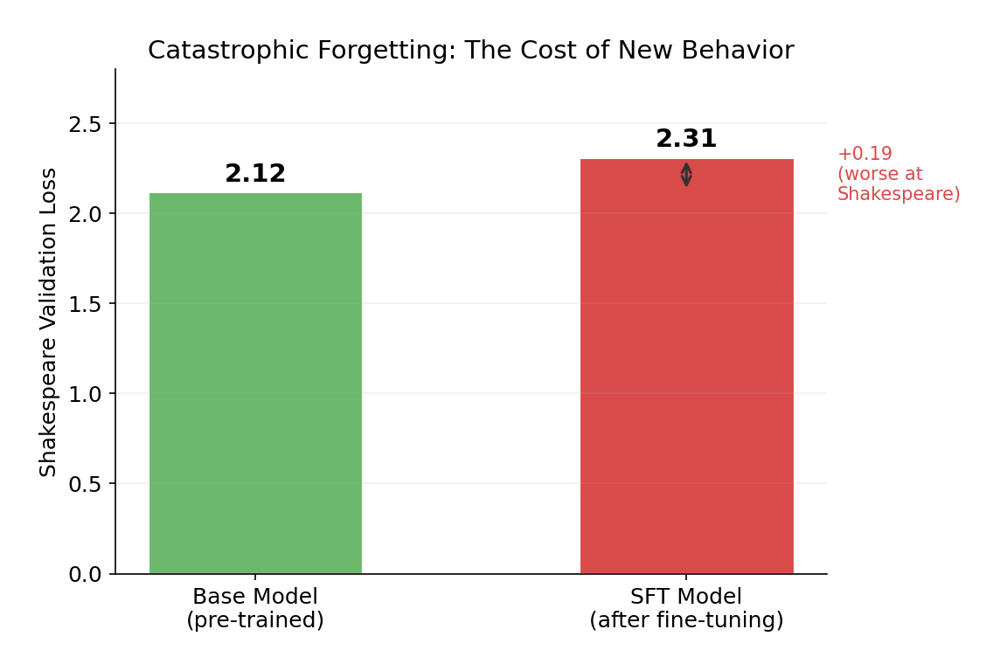
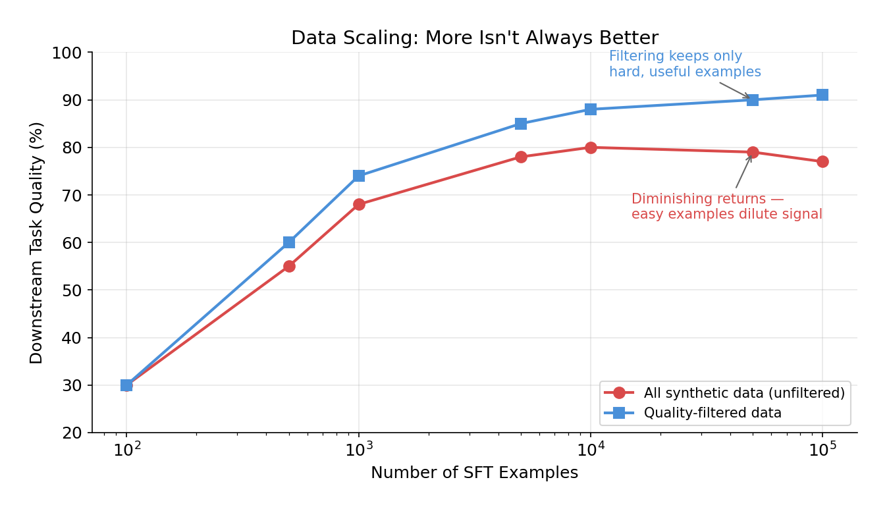

# From Autocomplete to Chatbot: SFT from Scratch

*How one training trick — loss masking — turns a base language model into something that actually follows instructions.*

---

**Table of Contents**

1. [The Problem: Pre-training Isn't Enough](#the-problem-pre-training-isnt-enough)
2. [The Three Stages of Post-Training](#the-three-stages-of-post-training)
3. [Stage 1: SFT — Teach the Format](#stage-1-sft--teach-the-format)
4. [Stage 2: Reward Model — Learn What "Good" Means](#stage-2-reward-model--learn-what-good-means)
5. [Stage 3: RL — Optimize for Quality](#stage-3-rl--optimize-for-quality)
6. [The Data Pipeline: From Expensive to Free](#the-data-pipeline-from-expensive-to-free)
7. [How OpenAI Built the InstructGPT Dataset](#how-openai-built-the-instructgpt-dataset)
8. [From Conversations to Tokens](#from-conversations-to-tokens)
9. [The SFT Model: Same Architecture, Updated Weights](#the-sft-model-same-architecture-updated-weights)
10. [The Conversation Dataset](#the-conversation-dataset)
11. [Preparing Training Data: The Loss Mask](#preparing-training-data-the-loss-mask)
12. [The Training Loop](#the-training-loop)
13. [Inference: What Happens When You Chat](#inference-what-happens-when-you-chat)
14. [Before vs. After](#before-vs-after)
15. [Catastrophic Forgetting: The Cost of New Behavior](#catastrophic-forgetting-the-cost-of-new-behavior)
16. [The Decision Guide: Building Your Own SFT Pipeline](#the-decision-guide-building-your-own-sft-pipeline)
17. [What SFT Doesn't Do](#what-sft-doesnt-do)
    - [Hallucination: Why SFT Models Make Things Up](#hallucination-why-sft-models-make-things-up)
    - [Mitigation #1: Teach the Model to Say "I Don't Know"](#mitigation-1-teach-the-model-to-say-i-dont-know)
    - [Mitigation #2: Teach the Model to Use Tools](#mitigation-2-teach-the-model-to-use-tools)
18. [SFT in 2025-2026: How the Industry Does It Now](#sft-in-2025-2026-how-the-industry-does-it-now)

---

## The Problem: Pre-training Isn't Enough

A pre-trained language model is an autocomplete engine. That's it. You give it text, it predicts what comes next. Ask it "What is love?" and it doesn't answer your question — it continues the text as if it were the next line in a book.

```
Prompt:  "What is love?"
Model:   "What is love? KING RICHARD: I tiny our ymy sumood veng..."
```

The model learned *language* — which tokens follow which — but not *behavior*. It has no concept of "someone asked me a question and I should answer it."

This is the gap that post-training fills. And it happens in three stages, each solving a different problem, each collecting data differently.

---

## The Three Stages of Post-Training

```
Pre-training          →    SFT          →    RLHF / DPO
learns language            learns format      learns quality
(internet text)            (demonstrations)   (preferences)
```

Here's the thing that clicked for me: each stage requires *less* human effort but produces *more* targeted improvement. It's a funnel from expensive general data to cheap specific feedback.

---

## Stage 1: SFT — Teach the Format

**The problem:** The model autocompletes. We need it to respond to instructions.

**How data is collected:** Humans write ideal responses from scratch. A labeler gets a prompt like "Explain the moon landing to a 6 year old" and writes the full response they want the model to produce. This is called **demonstration data** — humans demonstrating the desired behavior.

**What happens:** The model is fine-tuned on these (prompt, ideal response) pairs. Same loss function as pre-training (next-token prediction), but on curated conversation data instead of raw internet text. The critical twist: we only compute loss on the assistant's response, not the user's instruction.

**What it teaches:** Format. The model learns "when someone asks a question, produce an answer in this structure." It's like teaching a student *how* to write an essay — introduction, body, conclusion — before worrying about whether the essay is any good.

**Scale:** OpenAI used ~13,000 demonstration examples for InstructGPT. Quality matters more than quantity here — a few thousand expert examples beats millions of noisy ones.

> **Key insight:** SFT is expensive because humans have to *write* complete responses. But it only needs to happen once, and it doesn't need to be perfect — it just needs to teach the model the conversation format.

---

## Stage 2: Reward Model — Learn What "Good" Means

**The problem:** SFT teaches the model to respond, but all responses are treated equally. A brilliant response and a mediocre one get the same training signal. We need a way to score quality.

**How data is collected:** The SFT model generates multiple responses (A, B, C, D) to the same prompt. A human **ranks** them — D > C > A = B. That's it. No writing, just comparing.

This is the clever part: comparing is dramatically easier than creating. Ask someone to write a perfect explanation of gravity to a 6-year-old — that's hard. Show them four attempts and ask "which is best?" — that's fast.

**What happens:** A neural network (the reward model) is trained on these rankings. It learns to assign a scalar score to any (prompt, response) pair. Higher score = more preferred by humans. The architecture is the same transformer as the language model, but with the output layer replaced by a single number.

The loss function is elegant: given a preferred response and a rejected response, train the model so `score(preferred) > score(rejected)`.

```
Bradley-Terry loss: -log(sigmoid(r_chosen - r_rejected))
```

**What it teaches:** A machine proxy for human judgment. The reward model can now score *any* response without a human in the loop.

**Scale:** OpenAI used ~33,000 ranking comparisons for InstructGPT. Each ranking of K responses gives you K-choose-2 pairwise comparisons, so it's data-efficient.

> **Key insight:** The reward model converts "A is better than B" judgments into a trainable signal. Humans teach *taste*, the model learns to apply it at scale.

---

## Stage 3: RL — Optimize for Quality

**The problem:** We have an SFT model that responds in the right format, and a reward model that can score responses. Now we need to actually make the responses better.

**How data is collected:** No new human data needed. The process is fully automated:

```
prompt → model generates response → reward model scores it → model updates
                ↑                                                    |
                └────────────────────────────────────────────────────┘
                                    repeat
```

1. Sample a prompt from the dataset
2. The current model (called the **policy**) generates a response
3. The reward model scores it
4. The model's weights are updated to produce responses that score higher
5. A **KL penalty** prevents the model from drifting too far from the SFT model

That last point matters. Without the KL constraint, the model quickly discovers **reward hacking** — weird outputs that score high on the reward model but are actually gibberish. The model finds exploits in the reward model the way a video game speedrunner finds glitches. The KL penalty says: "improve, but stay coherent."

The specific RL algorithm used is **PPO** (Proximal Policy Optimization). The "proximal" part means "take small steps" — don't change the model too drastically in one update. This keeps training stable.

**What it teaches:** Quality. The model learns not just to respond, but to respond *well* — in the ways humans actually prefer.

> **Key insight:** RL needs no new human data. Humans taught the reward model what "good" means (Stage 2), and now the model optimizes against that definition automatically. Each stage of this pipeline transfers more human judgment into the model while requiring less human effort.

---

## The Data Pipeline: From Expensive to Free

| Stage | Who creates the data | Task for humans | Cost |
|---|---|---|---|
| SFT | Humans write responses | "Write the ideal answer" | High — creating is hard |
| Reward Model | Humans rank model outputs | "Which is better, A or B?" | Medium — comparing is easy |
| RL (PPO) | No humans needed | Automated loop | Low — compute only |

This is why the pipeline works at scale. You start with expensive demonstrations, extract human preferences cheaply, then run an automated optimization loop. Each stage bootstraps from the previous one.

DPO (Direct Preference Optimization) collapses Stages 2 and 3 into one step — it uses the same comparison data but trains the language model directly, skipping the reward model and RL entirely. Simpler, but the same core idea: learn from human preferences.

---

## How OpenAI Built the InstructGPT Dataset

The InstructGPT paper is where this pipeline was defined. Here's how they actually collected the data.

### The labelers

OpenAI hired **~40 contractors through Upwork and ScaleAI** — not random crowdworkers, but people screened for writing quality, ability to follow nuanced instructions, sensitivity to bias, and agreement with each other. These labelers were given prompts and asked to **write the ideal assistant response from scratch**.

```
Prompt:    "Explain gravity to a 5 year old"
Labeler:   "Gravity is like an invisible hand that pulls everything
            down toward the ground. When you throw a ball up in the
            air, gravity is what makes it come back down..."
```

Their instructions had three priorities, in order: be **helpful**, be **truthful**, be **harmless**. These guidelines became the model's personality — how ChatGPT sounds, when it hedges, how detailed it gets. ~40 freelancers defined the behavior of a model used by hundreds of millions of people.

### The prompts

Prompts came from three sources:
1. **Labeler-written** — labelers invented prompts across categories (instructions, few-shot examples, personas)
2. **API user prompts** — real prompts from early OpenAI API users (summarization, code, Q&A)
3. **Filtered API prompts** — sampled from the API with duplicates and PII removed

### The scale

| Dataset | Size | What labelers did |
|---|---|---|
| SFT demonstrations | ~13,000 | Wrote ideal responses from scratch |
| Reward model comparisons | ~33,000 | Ranked 4-9 model outputs per prompt |
| RL prompts | ~31,000 | No labeling — just prompts for the PPO loop |

The progression is deliberate: 13K written responses (hard, slow) → 33K rankings (easier, faster) → 31K prompts only (no human output needed). Each stage requires less human effort but builds on the previous one.

### What they learned — the surprising insights

**Validation loss and human preference diverge.** After just 1 epoch of SFT, validation loss started going *up* — the model was overfitting by the numbers. But OpenAI kept training for 16 epochs anyway, and human raters kept preferring the responses more and more. Why? Validation loss measures "can you predict the exact next token?" Humans don't care about exact token prediction — they care about tone, helpfulness, coherence. A response can differ from the reference and still be *better*. This is why OpenAI used reward model scores, not validation loss, to select their final SFT model. The metric you optimize for has to match what you actually care about.

**13K examples is enough for format, not quality.** 13K sounds small for a 175B parameter model. But SFT isn't teaching new knowledge — the model already knows things from pre-training on the internet. SFT just teaches a new *behavior*: "when someone asks you something, respond helpfully in this format." It's like teaching someone who's read millions of books to be a good customer service agent — they already know the answers, they just need to learn the *manner* of responding. But SFT treats every example equally. A brilliant response and a mediocre one get the same gradient. That's the gap RLHF fills.

**Comparing is easier than creating.** This asymmetry is why the three-stage pipeline exists. Getting a human to *write* a perfect response is hard and slow. Getting them to look at four responses and say "D > C > A > B" is fast and cheap. And RL needs no human data at all. The pipeline is designed to spend human effort only where it's irreplaceable.

---

## From Conversations to Tokens

Now let's build SFT from scratch. We start with a character-level GPT pre-trained on Shakespeare (from [the previous post](building-gpt-from-scratch.md)). It generates Shakespeare-like text, but it's pure autocomplete. We'll turn it into an instruction-following model.

Before we get to training, let's understand how conversation data actually becomes model input. The tokenization is the same as pre-training, but there are two important differences in *what* gets tokenized.

### Pre-training: raw text in, tokens out

During pre-training, the input is raw text. Shakespeare, in our case:

```
"To be, or not to be"  →  [20, 53, 1, 40, 43, ...]
```

Every character maps to a number. The model learns to predict the next one. That's it.

### SFT: structured conversations in, tokens out

During SFT, the input is a **structured conversation** with special tokens:

```
"<|user|>What is love<|end|><|assistant|>A madness most discreet<|end|>"
```

The tokenization works the same way — text becomes numbers. But now there are **new tokens** that didn't exist during pre-training:

```
Original vocabulary: 65 Shakespeare characters (a-z, A-Z, punctuation, etc.)

New tokens added for SFT:
    Token 65: <|user|>        — marks the start of a user message
    Token 66: <|assistant|>   — marks the start of the model's response
    Token 67: <|end|>         — marks the end of a turn
```

These special tokens are **single tokens**, not character sequences. `<|user|>` isn't tokenized as `<`, `|`, `u`, `s`, `e`, `r`, `|`, `>`. It's one token: ID 65. The model needs to recognize it as a single "switch" — if it were 8 separate characters, the model would have to learn that this specific sequence has special meaning, which is much harder.

Here's what a tokenized conversation looks like:

```
<|user|>  W   h   a   t  ...  <|end|>  <|assistant|>  A     ...  <|end|>
  65      23  46  39  58       67         66          13          67
```

### What's actually different from pre-training

**The structure is imposed, not natural.** Pre-training text is just... text. Conversations have an artificial structure: user turn, then assistant turn, separated by special markers. The model has never seen this structure before. SFT teaches it what the structure means.

**Loss masking changes what gets trained on.** During pre-training, every token contributes to the loss. During SFT, only the assistant's response tokens do. But this isn't a tokenization difference — it's a training difference. We'll cover this in detail below.

Think of it like this: pre-training data is a book. SFT data is a script with stage directions. Same language, same alphabet, but the script has markers that tell actors when to speak. The special tokens are those stage directions.

### Real-world chat templates

Every model family has its own chat template. Here's what ChatGPT/GPT-4 actually uses:

```
<|im_start|>user<|im_sep|>What is 2+2?<|im_end|>
<|im_start|>assistant<|im_sep|>2+2 = 4<|im_end|>
```

`im` stands for "imaginary monologue" — OpenAI's internal name for their chat format.

| Token | What it does |
|---|---|
| `<|im_start|>` | "A new turn is starting" |
| `user` or `assistant` | The role — who's speaking |
| `<|im_sep|>` | "Role name done, here comes the message" |
| `<|im_end|>` | "This turn is over" |

Compare to what we build in this post:

```
Ours:     <|user|>What is love<|end|><|assistant|>A madness most discreet<|end|>
OpenAI:   <|im_start|>user<|im_sep|>What is love<|im_end|><|im_start|>assistant<|im_sep|>A madness most discreet<|im_end|>
```

Same idea, just more verbose. OpenAI's version is more flexible because the role (`user`, `assistant`, `system`) is a separate word between `im_start` and `im_sep`, so they can add new roles without adding new special tokens. Other model families have their own templates — Llama uses `[INST]...[/INST]`, Claude uses `\n\nHuman:...\n\nAssistant:`. The specific tokens don't matter. The structure does.

> **Key insight:** SFT tokenization is the same process as pre-training — text becomes token IDs. The difference is that conversations include special tokens that act as structural markers, and we only train on the assistant's portion.

---

## The SFT Model: Same Architecture, Updated Weights

A common misconception: SFT must use a different model architecture. It doesn't. The SFT model is the **exact same transformer** — same multi-head attention, same feedforward layers, same residual connections, same layer normalization, same number of blocks. Not a single layer is added or removed.

```
Pre-trained model:                    SFT model:
┌──────────────────────────┐         ┌──────────────────────────┐
│ Token Embedding (65)     │ ──copy──▶ Token Embedding (68)     │ ← 3 new rows (random)
│ Position Embedding       │ ──copy──▶ Position Embedding       │
│                          │         │                          │
│ ┌──────────────────────┐ │         │ ┌──────────────────────┐ │
│ │ Block 1              │ │         │ │ Block 1              │ │
│ │  Multi-Head Attention│ │ ──copy──▶ │  Multi-Head Attention│ │
│ │  FeedForward         │ │         │ │  FeedForward         │ │
│ │  LayerNorm + Residual│ │         │ │  LayerNorm + Residual│ │
│ └──────────────────────┘ │         │ └──────────────────────┘ │
│ Block 2: ...             │ ──copy──▶ Block 2: ...             │
│ Block 3: ...             │ ──copy──▶ Block 3: ...             │
│ Block 4: ...             │ ──copy──▶ Block 4: ...             │
│                          │         │                          │
│ Output Head (→65 logits) │ ──copy──▶ Output Head (→68 logits) │ ← 3 new outputs (random)
└──────────────────────────┘         └──────────────────────────┘
```

Each block contains: multi-head attention (tokens look at each other and decide what's relevant), feedforward network (each token "thinks" independently through a 2-layer neural net), layer normalization (keeps values stable), and residual connections (skip connections that prevent information from getting lost in deep networks). Our model stacks 4 of these blocks. GPT-3 has 96. Same concept, different depth.

### How weights are transferred

1. **Create a new model** with vocabulary size 68 (all weights random)
2. **Copy every pre-trained weight** — attention layers, feedforward layers, layer norms, all copied exactly
3. **For the embedding and output head** — copy the first 65 rows (original characters). The 3 new rows (`<|user|>`, `<|assistant|>`, `<|end|>`) stay randomly initialized

After this copy, the SFT model is identical to the pre-trained model for all original tokens. It already knows Shakespeare. The only random parts are the embeddings for the 3 new special tokens.

### What SFT training does to the weights

During SFT, gradients flow through the **entire model** — not just the 3 new embeddings. Every attention weight, every feedforward weight, everything gets nudged slightly toward producing better responses after `<|assistant|>`. The lower learning rate (1e-4 vs 3e-4 in pre-training) keeps these nudges small so pre-trained knowledge isn't destroyed.

The weights don't get replaced. They get nudged. Think of it as the model's Shakespeare knowledge shifting slightly to also accommodate a new skill: responding to instructions.

---

## The Conversation Dataset

Each training example is a (instruction, response) pair formatted with the chat tokens:

```
<|user|>Write a greeting<|end|><|assistant|>Good morrow to thee, noble friend!<|end|>
```

Here are some example training conversations — all in Shakespeare's voice, since that's what the base model knows:

```python
conversations = [
    ("Write a greeting", "Good morrow to thee, noble friend!"),
    ("Say goodbye", "Farewell, and may fortune smile upon thee."),
    ("Who are you", "A humble player upon this stage of words."),
    ("Speak of love", "Love is a smoke raised with the fume of sighs."),
    ("I am sad", "Take heart, for sorrow fades as morning comes."),
    # ... 35 more examples covering questions, advice, emotions
]
```

40 examples is tiny. InstructGPT used 13,000. But even this small dataset is enough to teach a behavioral shift — the model learns the *pattern* (instruction → response) and can generalize to unseen prompts.

In practice, data quality matters far more than quantity. A few thousand carefully written examples by domain experts beats hundreds of thousands of noisy crowdsourced ones. The SFT dataset defines the model's personality.

For real-world open SFT datasets, [OpenAssistant Conversations (OASST)](https://huggingface.co/datasets/OpenAssistant/oasst1) is a good example — ~160K messages in conversation trees, written by volunteers. A typical example: `"User: What is the difference between a compiler and an interpreter? → Assistant: A compiler translates the entire source code into machine code before execution, while an interpreter translates and executes code line by line..."`. Same structure as what we're building, just at scale.

### Single-turn vs. multi-turn conversations

We use **single-turn** conversations — one user message, one assistant response:

```
<|user|>Write a greeting<|end|><|assistant|>Good morrow to thee, noble friend!<|end|>
```

Production models train on **multi-turn** conversations — multiple back-and-forth exchanges in one sequence:

```
<|user|>Hi<|end|><|assistant|>Hello! How may I help thee?<|end|><|user|>What is love?<|end|><|assistant|>A madness most discreet, a bitter sweet.<|end|>
```

The mechanics are identical. The only difference is that multi-turn has multiple assistant segments to train on — the mask alternates (user: masked, assistant: trained, user: masked, assistant: trained).

---

## Preparing Training Data: The Loss Mask

This is the section that makes SFT different from pre-training. Everything else — the model, the optimizer, the loss function — is borrowed. The loss mask is what's new.

### Step 1: Shift by one (same as pre-training)

We take a sequence of tokens, shift it by one position, and create (input, label) pairs. The model sees `input_ids` and should predict `labels`:

```
Tokens:     [65, 23, 56, 47, 58, 43, 67, 66, 19, 53, 53, 42, 67]
input_ids:  [65, 23, 56, 47, 58, 43, 67, 66, 19, 53, 53, 42]
labels:     [23, 56, 47, 58, 43, 67, 66, 19, 53, 53, 42, 67]
```

Position 0 sees token 65, should predict token 23. Same shift-by-one logic as pre-training.

### Step 2: Mask user tokens with -100 (new for SFT)

Now the key difference. We set every label in the user portion to `-100`:


```
input_ids:  [65,   23,   56,   47,   58,   43,   67,   66,   19,   53,   53,   42  ]
            <|user|> W     h     a     t     ...   <|end|> <|asst|> G     o     o     d
labels:     [-100, -100, -100, -100, -100, -100, -100, -100,  53,   53,   42,   67  ]
             ◄──────────── user: MASKED ──────────────────► ◄── assistant: TRAINED ──►
```

Why `-100`? It's PyTorch's convention. When you call `F.cross_entropy(logits, labels, ignore_index=-100)`, any position with label `-100` is **completely skipped** — zero loss, zero gradient.

### What -100 actually does: a position-by-position walkthrough

This is worth understanding in detail. Let's trace what happens at each position after the forward pass:

```
┌─────────────────────────────────────────────────────────────────────────┐
│                         FORWARD PASS                                    │
│  Model reads ALL tokens (user + assistant). Every token flows through   │
│  attention and feedforward. The model produces a prediction at EVERY    │
│  position. Nothing is skipped.                                          │
└────────────────────────────────┬────────────────────────────────────────┘
                                 │
                                 ▼
┌─────────────────────────────────────────────────────────────────────────┐
│                      LOSS COMPUTATION                                   │
│                                                                         │
│  Position 0: label = -100                                               │
│    → Cross-entropy sees -100 → SKIP                                     │
│    → Loss: 0    Gradient: 0                                             │
│                                                                         │
│  Position 1: label = -100                                               │
│    → SKIP. Loss: 0. Gradient: 0.                                        │
│                                                                         │
│  ...all user positions skipped...                                       │
│                                                                         │
│  Position 8: label = 53 (the token 'o')                                 │
│    → Model predicted 'o' with 40% confidence                            │
│    → Loss: -log(0.40) = 0.92                                            │
│    → Gradient FLOWS BACK through entire model ←──── weights get nudged  │
│                                                                         │
│  Position 9: label = 53 (the token 'o')                                 │
│    → Loss computed. Gradient flows.                                      │
│                                                                         │
│  ...all assistant positions graded...                                   │
└─────────────────────────────────────────────────────────────────────────┘
```

The crucial point: **the model reads everything, but is only graded on assistant tokens.** Think of it like a student reading a test question (no grade for reading) and writing an answer (graded). The reading is necessary — without it the student can't answer — but only the answer counts.

### Why mask user tokens at all?

Without masking, half the gradient would come from predicting user messages — teaching the model to write what users say. That's useless at inference (users write their own messages) and it dilutes the training signal. Masking focuses 100% of the learning on the only part that matters: generating good responses.


### Two masks, two purposes

This confused me at first: SFT has *two* completely different masks that do different things at different stages. Here's the distinction:

```
                    ┌─────────────────────────────────────┐
                    │         INSIDE THE MODEL             │
                    │                                      │
                    │    Causal Attention Mask              │
                    │    ┌──────────────────┐              │
                    │    │ 0  -∞  -∞  -∞   │              │
                    │    │ 0   0  -∞  -∞   │              │
                    │    │ 0   0   0  -∞   │              │
                    │    │ 0   0   0   0   │              │
                    │    └──────────────────┘              │
                    │    Prevents looking at future tokens │
                    │    Applied BEFORE softmax            │
                    │    Used in BOTH pre-training and SFT │
                    └─────────────────┬───────────────────┘
                                      │
                                      ▼
                              predictions for
                              every position
                                      │
                                      ▼
                    ┌─────────────────────────────────────┐
                    │        OUTSIDE THE MODEL             │
                    │                                      │
                    │    Loss Mask (-100 labels)            │
                    │                                      │
                    │    labels: [-100, -100, ..., 53, 67] │
                    │             ◄─ user ─►  ◄─ asst ──► │
                    │                                      │
                    │    Prevents gradient from user tokens │
                    │    Applied in loss function           │
                    │    Used ONLY in SFT                   │
                    └─────────────────────────────────────┘
```

| | Causal attention mask | Loss mask (-100) |
|---|---|---|
| **Where** | Inside the model's attention layers | In the loss function, after the forward pass |
| **When** | During the forward pass | During loss computation |
| **What it does** | Prevents tokens from looking at future tokens | Prevents gradient from user-token positions |
| **How** | Sets attention scores to `-inf` before softmax | Sets labels to `-100` in cross-entropy |
| **Affects what model sees?** | Yes | No — model sees all tokens normally |
| **Used in pre-training?** | Yes | No |
| **Used in SFT?** | Yes | Yes |

### Whole conversations, not random chunks

One more difference from pre-training. In pre-training, the training text is one long stream (~1M characters of Shakespeare). We randomly slice it into chunks of 64 tokens — each chunk is a random window into the text.

In SFT, each conversation is a **complete, self-contained sequence**. No slicing, no random windows. Each conversation becomes one training example, padded to the block size:

```
Conversation 1: <|user|>Write a greeting<|end|><|assistant|>Good morrow...<|end|>[pad][pad]...
Conversation 2: <|user|>Say goodbye<|end|><|assistant|>Farewell...<|end|>[pad][pad]...
```

You can't slice conversations in half — that would break the structure.

### Full worked example

Let's trace one conversation through the entire preparation pipeline:

```
Raw conversation:
  ("Write a greeting", "Good morrow to thee, noble friend!")

Step 1 — Wrap in chat template:
  "<|user|>Write a greeting<|end|><|assistant|>Good morrow to thee, noble friend!<|end|>"

Step 2 — Tokenize (each character or special token → a number):
  [65, 23, 56, 47, 58, 43, 1, 39, 1, 45, 56, 43, 43, 58, 47, 52, 45, 67, 66, 19, 53, 53, 42, ...]
   ↑                                                                  ↑   ↑
  <|user|>                                                        <|end|> <|assistant|>

Step 3 — Shift to create input/label pairs:
  input_ids: [65, 23, 56, 47, ..., 67, 66, 19, 53, ..., 67, 0, 0, 0]
  labels:    [23, 56, 47, 58, ..., 66, 19, 53, 53, ...,  0, 0, 0, 0]

Step 4 — Apply loss mask:
  labels:  [-100,-100,-100,-100, ...,-100,-100, 53, 53, ..., 67,-100,-100,-100]
            ◄──── user: MASKED ──────────────► ◄── assistant: TRAINED ──► ◄pad►
```

Multi-turn follows the same process — every user segment gets masked, every assistant segment gets trained on:

```
<|user|>Hi<|end|>  <|assistant|>Hello! How may I help?<|end|>  <|user|>What is love?<|end|>  <|assistant|>A madness most discreet.<|end|>
      -100 -100            ✓ ✓ ✓ ✓ ✓ ✓ ✓ ✓ ✓ ✓ ✓                    -100 -100 -100               ✓ ✓ ✓ ✓ ✓ ✓ ✓ ✓
  ◄─ user 1: masked ─►  ◄── assistant 1: TRAINED ──►            ◄── user 2: masked ──►        ◄── assistant 2: TRAINED ──►
```

### The code

```python
def prepare_sft_example(user_msg, asst_msg):
    text = f"<|user|>{user_msg}<|end|><|assistant|>{asst_msg}<|end|>"
    tokens = encode_sft(text)

    input_ids = tokens[:-1]    # what the model sees
    labels = tokens[1:]        # what it should predict (shifted by 1)

    # Find the <|assistant|> token position
    asst_pos = input_ids.index(ASSISTANT_TOKEN_ID)

    # Mask everything up to and including <|assistant|>
    for i in range(asst_pos + 1):
        labels[i] = -100       # ignored in loss computation

    return input_ids, labels
```

---

## The Training Loop

The SFT training loop is surprisingly similar to pre-training. Here's what stayed the same and what's different:

### Same as pre-training
- **Optimizer:** AdamW — same algorithm, same weight decay
- **Forward pass:** Model processes tokens, produces logits (predictions for every position)
- **Backward pass:** Compute gradients from the loss, update weights
- **Loss function:** Cross-entropy — still measuring "how well did you predict the next token?"
- **Batching:** Randomly sample a batch of examples each step

### New for SFT
- **Lower learning rate** (1e-4 vs 3e-4) — we're fine-tuning, not training from scratch. Large updates would destroy pre-trained knowledge.
- **`ignore_index=-100`** in cross-entropy — the one line that makes it SFT. Masked positions contribute zero to the loss and zero to the gradient.
- **Dataset is conversations, not text chunks** — we sample from 40 complete conversations instead of random slices of Shakespeare.

```python
optimizer = torch.optim.AdamW(sft_model.parameters(), lr=1e-4)  # lower LR than pre-training

for step in range(1000):
    xb, yb = get_sft_batch()                          # sample conversations (not text chunks)
    logits, _ = sft_model(xb)
    loss = F.cross_entropy(logits, yb, ignore_index=-100)  # THE key line — only grade assistant tokens

    optimizer.zero_grad()
    loss.backward()
    optimizer.step()
```

1,000 steps. 40 examples. The loss drops from ~4.0 to ~0.3 — the model quickly learns the conversation pattern.


Notice the shape: the model learns the chat format fast (the steep drop in the first ~200 steps), then gradually memorizes specific responses. This is typical of SFT on small datasets — format is learned quickly, content takes longer.

---

## Inference: What Happens When You Chat

After SFT training, how does the model actually respond to a message? You type "What is love?" — but the model never sees that raw text. The system wraps it in the chat template first:

```
You type:         What is love?

System wraps it:  <|user|>What is love?<|end|><|assistant|>
                                                    ↑
                                              this is the trigger
```

The `<|assistant|>` at the end is the trigger. SFT trained the model on examples where `<|assistant|>` was always followed by a helpful response — so that's what it predicts next. Token by token:

```
┌─────────────────────────────────────────────────────────────────────┐
│  <|user|>What is love?<|end|><|assistant|>                          │
│                                            ↓                        │
│                                  model predicts: "A"                │
│                                                                     │
│  <|user|>What is love?<|end|><|assistant|>A                         │
│                                             ↓                       │
│                                  model predicts: " "                │
│                                                                     │
│  <|user|>What is love?<|end|><|assistant|>A                         │
│                                              ↓                      │
│                                  model predicts: "m"                │
│                                                                     │
│  ...continues until the model generates <|end|>, then stops.        │
└─────────────────────────────────────────────────────────────────────┘
```

The model doesn't "know" it's a chatbot. It's still just autocompleting — but SFT shaped *what* gets autocompleted after `<|assistant|>`. For multi-turn conversations, the system concatenates the entire history before appending the next `<|assistant|>` trigger, which is why context windows eventually fill up.

```python
def chat(model, user_msg):
    prompt = f"<|user|>{user_msg}<|end|><|assistant|>"  # system adds the template
    tokens = encode_sft(prompt)
    output = model.generate(tokens, max_new_tokens=60)   # same generate() as pre-training
    # extract text after <|assistant|>, stop at <|end|>
```

---

## Before vs. After

The behavioral shift is immediate and visible:

```
┌──────────────────────┬──────────────────────────────────────────────────┐
│ Prompt               │ Base model (autocomplete)  → SFT model (chatbot)│
├──────────────────────┼──────────────────────────────────────────────────┤
│ "Write a greeting"   │ "Write a greeting do       → "Good morrow to    │
│                      │  sther and LUCHENTT..."       thee, noble friend!"│
├──────────────────────┼──────────────────────────────────────────────────┤
│ "Who are you"        │ "Who are you, fares be     → "A humble player    │
│                      │  a that the kin..."           upon this stage."   │
├──────────────────────┼──────────────────────────────────────────────────┤
│ "Speak of love"      │ "Speak of love be dond     → "Love is a smoke    │
│                      │  and KING wose..."            raised with sighs." │
└──────────────────────┴──────────────────────────────────────────────────┘
```

The base model treats every prompt as text to continue. The SFT model recognizes the chat template and switches into response mode. Same architecture, same weights (mostly) — the only difference is 1,000 steps of fine-tuning with loss masking.

The more interesting test is **unseen prompts** — instructions that never appeared in the training data:

```
"Tell a joke"         (not in training data)  →  "A fool with wit is wiser than a sage!"
"Describe the moon"   (not in training data)  →  "The moon doth rise upon the sleeping world."
```

The model generalized. It didn't memorize 40 question-answer pairs — it learned the *pattern*: when you see `<|user|>...<|end|><|assistant|>`, switch from reading to responding. The special tokens became behavioral triggers.

**A note on our tiny model:** with only 4 blocks, 64-dimensional embeddings, and ~200K parameters, the responses are imperfect. A real SFT model (with billions of parameters and thousands of training examples) produces much more coherent output. The point here is the *mechanics* — the architectural pattern is identical whether the model has 200K or 200B parameters.

---

## Catastrophic Forgetting: The Cost of New Behavior

SFT isn't free. Fine-tuning shifts the model's weights toward the conversation format, and some pre-training knowledge gets overwritten. This is called **catastrophic forgetting**.

We can measure it by checking the model's loss on the original Shakespeare validation data:



The SFT model traded some language modeling ability for instruction-following ability. The weights can't fully serve both purposes.

In production, teams mitigate this with:
- **Mixing in pre-training data** during SFT (OpenAI's PPO-ptx approach)
- **LoRA** — only fine-tune ~1% of the parameters through small adapter matrices, leaving the pre-trained weights frozen
- **Lower learning rates** — smaller updates mean less overwriting

> **Key insight:** Every new behavior has a cost. SFT teaches the model *what to do*, but it slightly forgets *what it knew*. This trade-off is fundamental — it's why parameter-efficient methods like LoRA exist.

---

## The Decision Guide: Building Your Own SFT Pipeline

You understand the mechanics. Now the harder question: how do you make the right choices when building your own SFT pipeline? Every decision below involves a tradeoff. Here's how to reason about each one.

### How much data do you need?

The short answer: less than you think, if it's good.

SFT isn't teaching new knowledge — the model already learned that during pre-training. SFT is teaching a *behavior*: "when someone asks you something, respond helpfully." Behaviors are learned from fewer examples than knowledge.

| Goal | Dataset size | Why |
|---|---|---|
| Teach the chat format | ~100-500 examples | The model just needs to learn the structural pattern |
| Teach a specific persona or domain | ~1K-5K examples | More variety needed to generalize |
| Production-quality instruction-following | ~5K-50K (filtered) | Diversity across task types matters |

The InstructGPT insight that surprised everyone: 13K examples was enough for a 175B parameter model. But those 13K were written by carefully selected human labelers. One high-quality example is worth more than a hundred noisy ones.

**The practical test:** generate 5-10 responses from your SFT model on prompts *not* in the training data. If the model follows the format but gives mediocre answers — your SFT is working, and quality improvement is a job for RLHF/DPO, not more SFT data. If the model doesn't follow the format at all — you need more diverse examples of the format.

### Choosing the learning rate

This is the most consequential hyperparameter in SFT.


**Too high (e.g. same as pre-training):** The model learns the chat format fast but overwrites pre-trained knowledge. You'll see unstable loss curves with spikes, and the model may produce incoherent outputs that happen to follow the chat template. Catastrophic forgetting gets severe.

**Too low:** The model barely moves from its pre-trained behavior. After 1,000 steps it still autocompletes instead of responding to instructions. You're wasting compute.

**The sweet spot** is typically **2x-10x lower than the pre-training learning rate**. For our model: pre-training used 3e-4, SFT uses 1e-4. For production models pre-trained at 1e-4, SFT often uses 1e-5 to 5e-5.

**A practical heuristic:** start at 1/3 of your pre-training LR. If the loss drops smoothly and the model generates coherent responses after ~200 steps, you're in the right range. If the loss is jumpy, halve the LR. If the loss barely moves after 500 steps, double it.

### When to stop training

This is where SFT gets counterintuitive. Unlike pre-training, **lower loss doesn't always mean a better model.**

The InstructGPT team found that validation loss started going *up* after just 1 epoch — the model was overfitting by the numbers. But they kept training for 16 epochs, and human raters kept preferring the responses more and more. Why?

Validation loss measures "can you predict the exact next token in a held-out conversation?" But that's not what you actually care about. You care about: does the model follow instructions? Is the response helpful? A response can differ from the reference and still be *better*.

**What to watch instead:**

1. **Manual spot-checking** — the most reliable signal. Every 200-500 steps, generate responses to 10-20 test prompts (mix of seen and unseen). Read them. Are they following the format? Are they coherent? This is what OpenAI used to select their final SFT model.

2. **Format compliance rate** — what percentage of responses start with a coherent answer and end with `<|end|>`? This should climb quickly and plateau.

3. **Training loss (with caveats)** — useful for catching problems (loss going *up* means something is broken, spikes mean LR is too high), but not useful as a selection criterion.

**A reasonable stopping rule:** train for 2-5 epochs over your dataset. Checkpoint every epoch. Pick the checkpoint where manual evaluation looks best, not where loss is lowest.

### With or without loss masking?

Always use masking. But it's worth understanding what happens without it, so you can debug if you accidentally skip it.

**Without masking:** the model trains on predicting both user and assistant tokens. ~50% of the gradient comes from learning to generate user messages. The model may start producing outputs like `"User: Tell me about love\nAssistant: Love is..."` — it learned to write the entire conversation, including the user's part. At inference, when you prompt with `<|assistant|>`, the model might generate user messages instead of responding.

**With masking:** 100% of the gradient goes toward generating good responses. The model reads user tokens (they flow through attention) but is only graded on what it generates. Cleaner, faster convergence.

**The one exception:** some teams train *without* masking intentionally when they want the model to learn to simulate conversations (e.g., for synthetic data generation). But for building a chatbot, always mask.

### How to evaluate SFT quality

Loss alone is a poor signal. Here's a practical evaluation framework:

**1. Format compliance (automated)**
```python
# After generating a response, check:
# - Does it contain content after <|assistant|>?
# - Does it stop at <|end|> (not run on forever)?
# - Does it NOT generate <|user|> tokens (it shouldn't write user messages)?
```

**2. Generalization test (manual, most important)**

Test on prompts the model never saw during training. If your SFT dataset is about customer service, try:
- In-domain unseen: new customer service questions
- Near-domain: general helpfulness questions
- Out-of-domain: completely unrelated instructions

If the model handles in-domain unseen prompts well, SFT is working. If it also handles near-domain, it generalized the format — not just the content. That's what you want.

**3. Regression check (automated)**

Measure loss on a held-out set from the pre-training data. If it increased by more than ~10-15%, catastrophic forgetting is getting severe. Consider lowering the learning rate or adding pre-training data to your SFT mix.

### Failure modes and how to fix them

| Symptom | Likely cause | Fix |
|---|---|---|
| Model ignores chat format, just autocompletes | Too few training steps or LR too low | Train longer or increase LR |
| Model follows format but outputs are incoherent gibberish | LR too high — destroyed pre-trained knowledge | Lower LR, restart from pre-trained checkpoint |
| Model memorizes training examples verbatim | Too many epochs on too small a dataset | Add more diverse examples, or stop earlier |
| Model generates user messages in its response | Loss masking not applied correctly | Debug your mask — check that all labels before `<|assistant|>` are -100 |
| Good on training prompts, bad on unseen prompts | Overfitting to specific prompts | Add more diverse prompts (not more responses per prompt) |
| Shakespeare quality dropped significantly | Too many SFT steps or LR too high | Mix in pre-training data, use LoRA, or reduce epochs |

### Data quality checklist

Before training, audit your dataset:

- **Consistent format** — every example follows the same chat template exactly. One missing `<|end|>` token can confuse the model.
- **Response quality** — the model will imitate your data. If your responses are mediocre, the SFT model will be mediocre. This is not something more data fixes.
- **Prompt diversity** — 50 examples of "write a poem" teach less than 5 examples each of 10 different task types. Breadth of prompts matters more than depth.
- **Appropriate length** — responses should be similar in length to what you want at inference. If all training responses are 3 sentences, the model will learn to generate ~3 sentences.
- **No contradictions** — if one example says "I am a helpful assistant" and another says "I am a Shakespearean poet," the model will randomly pick between them. Be consistent about what the model is.

### Putting it together: a minimal SFT recipe

If you're building SFT from scratch, here's the sequence:

1. **Start with a pre-trained model** that generates coherent text in your domain
2. **Write 50-100 high-quality examples** by hand — these set the tone and format
3. **Expand to 500-5K examples** synthetically (use a stronger model) or via careful collection
4. **Filter aggressively** — remove duplicates, low-quality responses, and anything off-format
5. **Train for 2-3 epochs** at 1/3 of the pre-training LR
6. **Evaluate manually** on 20+ unseen prompts after each epoch
7. **Pick the best checkpoint** based on manual eval, not loss
8. **Check regression** on pre-training data to monitor forgetting

This gets you a model that follows instructions. Quality improvement — making responses *good*, not just *formatted* — is the job of RLHF or DPO.

---

## What SFT Doesn't Do

SFT teaches format, not quality. Every training example gets the same weight. A brilliant response and a mediocre one produce identical gradients. The model learns "when prompted, generate a response" — but it has no mechanism to learn *which* responses are better.

This is the gap that the next stages fill:
- **RLHF** trains a reward model on human preferences, then uses reinforcement learning (PPO) to optimize the policy toward higher-scoring responses
- **DPO** skips the reward model entirely and trains directly on preference pairs using a single loss function

SFT is the foundation. It gets the model into the right format so that preference learning can refine the quality. Without SFT, the model wouldn't know how to respond at all. Without RLHF or DPO, the model responds but doesn't know what "good" means.

```
Pre-training    →    SFT           →    RLHF / DPO
learned language     learned format      learned quality
```

### Hallucination: why SFT models make things up

There's a deeper problem SFT doesn't fix: **hallucination**. The model confidently generates plausible-sounding but factually wrong information. This isn't a bug — it's a direct consequence of how the model works.

Remember: the model is still just predicting the next token. During pre-training, it learned which tokens are *likely* to follow which. During SFT, it learned to produce those likely tokens in a response format. But "likely" is not "true." The model has no internal fact-checker. It doesn't know what it knows and what it doesn't know.

```
User:  "Who is Orson Kovacs?"

Model: "Orson Kovacs was a Hungarian-born physicist who contributed
        to early quantum mechanics research at the University of..."
```

The model has never seen "Orson Kovacs" (a made-up name). But it's seen thousands of similar patterns: `"[Name] was a [nationality] [profession] who..."`. SFT taught it to respond helpfully and confidently to questions. So it does — by generating statistically plausible text. It doesn't have a mechanism to say "I've never seen this name in my training data, I should say I don't know."

**Why this happens mechanically:** at each position, the model outputs a probability distribution over tokens. It picks the most likely next token (or samples from the distribution). Nothing in the cross-entropy loss penalizes factual incorrectness — it only penalizes predicting the wrong *token* relative to the training example. If the training data never included "I don't know" responses, the model never learns to produce them.

### Mitigation #1: Teach the model to say "I don't know"

Include examples in the SFT dataset where the correct response is a refusal:

```
User:      "Who is Orson Kovacs?"
Assistant: "I'm sorry, I don't believe I know who that is."

User:      "What happened on March 45th?"
Assistant: "That isn't a valid date. March only has 31 days."
```

But how do you know *which* questions the model should refuse? You can't guess — a 70B model knows different facts than an 8B model. The same refusal dataset doesn't work for both.

The Llama 3 approach: **use the model to probe itself, use a stronger model to verify.**

```
Step 1 — Collect factual questions
         (from knowledge benchmarks, trivia datasets, generated prompts)

Step 2 — Sample multiple responses from YOUR model
         Ask each question 5-10 times with temperature sampling:

         "Who wrote Hamlet?"  →  "Shakespeare" (5/5 times)
         "Capital of Bhutan?" →  "Thimphu" (3/5), "Paro" (2/5)
         "Who is Orson Kovacs?" → 5 different confident wrong answers

Step 3 — Use a STRONGER model (the "judge") to grade the responses
         Feed each response to a more capable LLM:
         "Is this factually correct? [response]" → correct / incorrect

Step 4 — Create SFT training data based on the results:

         Model consistently correct   →  use its own correct answer
         Model consistently WRONG     →  "I don't have enough info to answer."
         Model mixed (sometimes right) →  use only the correct responses
```

The key insight: you're **mapping the knowledge boundary of this specific model**. By sampling from the model itself, you discover *its* blind spots — questions where it confidently produces wrong answers every time. Then you create refusal training data for exactly those cases.

**Why use a different (stronger) LLM as judge?** The model can't judge its own answers — it doesn't know what it doesn't know (that's the whole problem). You need an external source of truth. The judge doesn't need to be perfect — it just needs to be more reliable than the model being trained.

The entire pipeline is automated. No human writes a single "I don't know" response:

1. Generate thousands of factual questions
2. Batch-sample responses from your model
3. Batch-judge with the stronger model
4. Programmatically create the refusal SFT examples
5. Mix these into your regular SFT data (~5-10% of the dataset)

This works for clear-cut factual questions. But it has limits — the model still can't reason about *degrees* of uncertainty, and it can't handle questions where the boundary between "I know this" and "I'm guessing" is fuzzy. That's where tool use comes in.

### Mitigation #2: Teach the model to use tools

This is the more powerful approach, and it's taught through SFT using the same special token pattern we've already seen.

Instead of making up an answer, the model learns to **pause generation, emit a search query, and wait for results** before continuing. The SFT training data includes examples like this:

```
User:      "Who is Orson Kovacs?"
Assistant: <SEARCH_START>Who is Orson Kovacs?<SEARCH_END>
           [search results injected here by the system]
           Based on the search results, Orson Kovacs appears to be...
```

Here's how this works mechanically — and it uses the exact same principles we built:

**1. New special tokens.** Just like we added `<|user|>`, `<|assistant|>`, and `<|end|>`, the model's vocabulary is expanded with tool tokens: `<SEARCH_START>`, `<SEARCH_END>`, `<RESULT_START>`, `<RESULT_END>`, etc. These are single tokens, not character sequences.

**2. SFT on tool-use examples.** The training data includes conversations where the assistant generates a search query wrapped in special tokens. The model learns: "when I'm uncertain or the question is about specific facts, emit `<SEARCH_START>query<SEARCH_END>` instead of guessing."

**3. Generation pauses at the tool token.** This is the key mechanical detail. During inference, the system monitors the model's output token by token. When the model generates `<SEARCH_END>`, **generation stops**. The system:

```
┌──────────────────────────────────────────────────────────────────┐
│  INFERENCE WITH TOOL USE                                          │
│                                                                    │
│  1. User sends: "Who is Orson Kovacs?"                            │
│                                                                    │
│  2. Model generates token by token:                               │
│     "< SEARCH_START> Who is Orson Kovacs? <SEARCH_END>"           │
│                          ↑                                         │
│                    system detects this token                       │
│                          │                                         │
│  3. Generation STOPS. System extracts the query.                  │
│                          │                                         │
│  4. System runs the actual search (web API, database, etc.)       │
│                          │                                         │
│  5. System injects results into the context:                      │
│     "...< SEARCH_END><RESULT_START>Orson Kovacs is a fictional    │
│     character in...<RESULT_END>"                                  │
│                          │                                         │
│  6. Generation RESUMES. Model now has real information to         │
│     condition on, and continues:                                  │
│     "Based on the search results, Orson Kovacs appears to be..." │
└──────────────────────────────────────────────────────────────────┘
```

The model doesn't "decide" to search in some high-level cognitive sense. It learned during SFT that certain types of questions are followed by `<SEARCH_START>` in the training data. It's still just predicting the next token — but the next token happens to trigger a real system action.

**4. The model conditions on real data.** After the search results are injected, the model continues generating. Now its attention can look back at the actual search results. Instead of inventing facts from statistical patterns, it's summarizing and reasoning over *real information* that was inserted into its context window.

### This is SFT all the way down

Tool use isn't a separate capability bolted onto the model. It's SFT with a different dataset:

| What SFT teaches | Training data looks like | Special tokens |
|---|---|---|
| Chat format | `<user>instruction<end><assistant>response<end>` | `<user>`, `<assistant>`, `<end>` |
| Tool use | `<SEARCH_START>query<SEARCH_END>` | `<SEARCH_START>`, `<SEARCH_END>` |
| Code execution | `<CODE>python code<CODE_END>` | `<CODE>`, `<CODE_END>` |
| Refusal | "I don't know" responses | (no new tokens needed) |

The pattern is always the same: define special tokens, create training examples that demonstrate the behavior, fine-tune with loss masking. The system around the model watches for specific tokens and takes action. The model itself is still just autocompleting — but the special tokens give it a way to *request* actions from the outside world.

This is why understanding SFT deeply matters. Every major capability of modern chatbots — chat, tool use, code execution, function calling — is built on the same foundation: structured training data with special tokens, and a system that acts on those tokens at inference time.

---

## SFT in 2025-2026: How the Industry Does It Now

Everything above is the core mechanism — it hasn't changed. What's changed dramatically is **where the data comes from**.

In 2022, OpenAI hired ~40 contractors to write 13K responses by hand. In 2025, the industry generates millions of SFT examples synthetically, using stronger models to train weaker ones. Humans moved from **data creators** to **system designers**.

### The shift: synthetic data dominates

The pattern across every major lab is the same: a small set of human-written seed examples, massively expanded by LLMs, then aggressively filtered for quality.

```
┌────────────────────────────────────────────────────────────────┐
│  THE MODERN SFT DATA PIPELINE                                  │
│                                                                │
│  Human seed data (~hundreds)                                   │
│       │                                                        │
│       ▼                                                        │
│  Synthetic expansion via teacher model (~millions)             │
│       │                                                        │
│       ▼                                                        │
│  Quality filtering via model-as-judge (~thousands survive)     │
│       │                                                        │
│       ▼                                                        │
│  Lightweight SFT                                               │
│       │                                                        │
│       ▼                                                        │
│  Online RL (the new heavy lifting)                             │
│       │                                                        │
│       ▼                                                        │
│  DPO (final polish)                                            │
└────────────────────────────────────────────────────────────────┘
```

- **NVIDIA (Nemotron)**: ~98% synthetic data. 18M+ SFT samples total, only ~20K human-annotated. The humans wrote seeds; the models wrote everything else.
- **DeepSeek (R1)**: Generated 800K reasoning traces entirely synthetically. Their key finding: synthetic reasoning chains from R1 actually **outperform human-expert chains** on downstream tasks.
- **Meta (Llama 4)**: Went the opposite direction on volume — they **pruned 50-95% of their SFT data**, keeping only the hardest examples. Used Llama models as judges to tag "easy" examples and threw them away.
- **Anthropic (Claude)**: Uses Constitutional AI — Claude generates responses, critiques them against a written constitution ("be helpful, be honest, avoid harm"), revises them, and the revised versions become training data. Humans wrote the constitution, not the training examples.

### What "pruning" means

Pruning is counterintuitive: you generate a large dataset, then **deliberately throw most of it away**.

Why? Because most synthetic examples are "easy" — the model can already handle them. Training on easy examples wastes compute and can actually hurt performance. The approach:

```
Generate 100K synthetic SFT examples
    → Use a model-as-judge to score difficulty
    → Remove the 95K easiest examples
    → Train on the remaining 5K hardest examples
    → Result: model learns more from less data
```



### Quantity vs. quality: the pendulum swung

| Era | Approach | SFT dataset size |
|---|---|---|
| 2022 (InstructGPT) | Human-written, all used | ~13K |
| 2023 (Alpaca, Vicuna) | Synthetic, use everything | ~50K-100K |
| 2025 (Llama 4, R1) | Synthetic, aggressively pruned | ~5K-50K after filtering |

The industry learned that dumping more synthetic data doesn't help — and can hurt. The modern recipe is: generate a lot, filter ruthlessly, keep only what pushes the model's boundaries.

### What each lab focuses on

| Lab | SFT philosophy | Key innovation |
|---|---|---|
| **Meta** | Less is more — lightweight SFT, then heavy RL | Model-as-judge pruning; SFT → Online RL → DPO pipeline |
| **DeepSeek** | Distillation at scale | Teacher model generates reasoning traces; student learns to think step-by-step |
| **Anthropic** | Self-improvement via constitution | Model critiques and revises its own outputs; humans write principles, not data |
| **NVIDIA** | Massive synthetic pipelines | 18M+ examples with automated quality filtering |
| **OpenAI** | Reasoning-first | Deep integration of chain-of-thought into post-training (details sparse) |

The core SFT mechanism is exactly what we built: special tokens, loss masking, next-token prediction on conversation data. What changed is that the data pipeline around it became an engineering discipline of its own.

---

*This is part of a series where I build every stage of the LLM training pipeline from scratch. [Previous: Building a Language Model from Scratch](building-gpt-from-scratch.md).*
